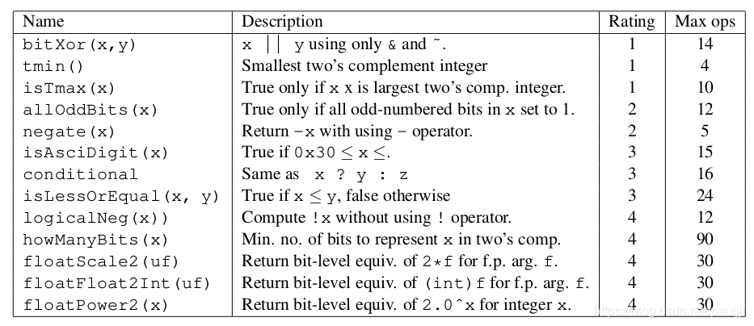

# 前言（Intro)

​	计算机系统或者说体系结构，素来属于计算机专业学生的基本功，于是为了加深对系统的理解，笔者开启了这门著名的Computer Systems: A Programmer's Perspective (CS:APP)。在欧洲进行交换项目的同时，笔者用了大概一个半月的时间收掉了这门课。从刚开始对于bit\byte都不太熟悉，到最后手搓Malloc函数、设计自己的proxy服务器、实现简易的类shell的命令行解释器tsh，整个过程让我如痴如醉，对计算机系统的理解肉眼可见地日益加深。


本书目录分为：

```
Chapter 1 A Tour of Computer Systems
Chapter 2 Representing and Manipulating Information
Chapter 3 Machine-Level Representation of Programs
Chapter 4 Processor Architecture
Chapter 5 Optimizing Program Performance
Chapter 6 The Memory Hierarchy
Chapter 7 Linking
Chapter 8 Exceptional Control Flow
Chapter 9 Virtual Memmory
Chapter 10 System-Level I/O
Chapter 11 Network Programming
Chapter 12 Concurrent Programming
```

从笔者的感受来说，做完这些lab大概可以获得的能力：

1. 对计算机补码，二进制操作会有更加深刻的认识，对浮点数存储方式能有清晰的了解;
2. 能够具有汇编、反汇编的能力和掌握使用 gdb 调试的基本功;
3. 能够了解到 CPU 的运行方式，对CPU识别指令的过程，以及栈溢出攻击有所了解;
4. 能够加深对流水线，以及底层优化指令运行方法的理解，提高优化代码的能力;
5. 学习到LRU的实现，了解cache的工作原理，写出让cache命中率更高的代码;
6. 能学到信号的使用，多进程的处理，管道的使用;
7. 学到内存管理的知识，加深对对指针和链表的理解;
8. 学到多进程（多线程）编程的思想，学习到多路复用的基本思想，客户端、服务端开发的雏形;

简而言之，看完这本书让我可以非常形象地认识到，一份代码是如何从高级语言一步一步，经由翻译器和连接器，变成机器可读的可执行文件，以byte的形式存储到内存中；也可以非常深入地建立起对于进程、执行和回收的解读，了解如何利用网络在不同主机之间发送和接受消息的全过程……

所以，不论是已经对体系结构了然于心还是对系统运行一无所知，如果你仍然对于计算机系统有着无穷的好奇心，那么，这本书、这门课，我想，应该会是很好的帮手。

# 简介(Synopsis)

## Lecture

#### A Tour of Computer Systems

第1章是计算机系统漫游，核心就是讲清楚一个程序是如何编译运行起来的，以及如何将程序转换为字节码；介绍了可执行文件的组成、链接的过程和链接器的作用；阐述了系统的层次结构和抽象，硬件和软件之间的互动。

#### Representing and Manipulating Information

第2章重点在于介绍数值存储系统、位运算方法、IEEE浮点数编码和字节序的内容，例如：无符号 vs 有符号，整型溢出问题 ，比特操作 ( &， |，  ~， ^ ) vs 逻辑操作 (&&， ||， !)

#### Machine-Level Representation of Programs

第3章的主要任务是详细学习一种特别的汇编语言，了解如何将 C 程序编译成这种形式的机器代码。整体的表述基于 x86-64，一种现在笔记本电脑和台式机中最常见处理器的机器语言，也是驱动大型数据中心和超级计算机的最常见处理器的机器语言。本章只关注 GCC 和 Linux 使用的那些特性，这样可以避免 X86-64 的大量复杂性和许多隐秘特性。

在技术讲解之前，先快速浏览 C 语言、汇编代码以及机器代码之间的关系。然后介绍 x86-64 的细节，从数据的表示和处理以及控制的实现开始。了解如何实现 C 语言中的控制结构，如 if、while 和 switch 语句。之后会讲到过程的实现，包括程序如何维护一个运行栈来支持过程间数据和控制的传递，以及局部变量的存储。接着，内容来到在机器级如何实现像数组、结构和联合这样的数据结构。有了这些机器级编程的背景知识，就可以继续讨论内存访问越界的问题，以及系统容易遭受缓冲区溢出攻击的问题。在这一部分的结尾，也会给出一些用 GDB 调试器检査机器级程序运行时行为的技巧。本章的最后展示了包含浮点数据和操作的代码的机器程序表示。

#### Processor Architecture

第4章将简要介绍处理器硬件的设计。我们将研究一个硬件系统执行某种 ISA 指令的方式，同时介绍处理器的执行过程，流水线设计等，原书作者为了写这章花费了不少心血，设计了一个 Y86-64 指令集来为我们讲解处理器硬件的设计，HCL(Hardware Control Language)和流水线处理等等。这会使你能更好地理解计算机是如何工作的，以及一些计算机制造商们面临的技术挑战。

#### Optimizing Program Performance

第5章主要讲解如何编写高效的程序，如何选择一组适当的算法和数据结构。如何编写出编译器能够有效优化以转换成高效可执行代码的源代码。对于这一点，理解优化编译器的能力和局限性是很重要的。编写程序方式中看上去只是一点小小
的变动，都会引起编译器优化方式很大的变化。有些编程语言比其他语言容易优化。现代编译器采用了复杂的分析和优化形式，而且变得越来越好。然而，即使是最好的编译器也受到妨碍优化的因素(optimization blocker)的阻碍，妨碍优化的因素就是程序行为中那些严重依赖于执行环境的方面。程序员必须编写容易优化的代码，以帮助编译器。程序优化的第一步就是消除不必要的工作，让代码尽可能有效地执行所期望的任务。这包括消除不必要的函数调用、条件测试和内存引用。

#### The Memory Hierarchy

第6章中，书本会带我们会看看基本的存储技术一-SRAM存储器、DRAM存储器、ROM存储器以及旋转的和固态的硬盘一一并描述它们是如何被组织成层次结构的。特别地，我们将注意力集中在高速缓存存储器上，它是作为 CPU 和主存之间的缓存区域，因为它们对应用程序性能的影响最大。本章将展示如何分析 C程序的局部性，并且介绍改进你的程序中局部性的技术。你还会学到一种描绘某台机器上存储器层次结构的性能的有趣方法称为“存储器山(memory mountain)”，它展示出读访问时间是局部性的一个函数。


实际上，存储器系统(memory system)是一个具有不同容量、成本和访问时间的存储设备的层次结构。CPU 寄存器保存着最常用的数据。靠近CPU 的小的、快速的高速缓存。存储器(cache memory)作为一部分存储在相对慢速的主存储器(main memory)中数据和指令的缓冲区域。主存缓存存储在容量较大的、慢速磁盘上的数据，而这些磁盘常常又作为存储在通过网络连接的其他机器的磁盘或磁带上的数据的缓冲区域。

这个思想围绕着计算机程序的一个称为局部性(locality)的基本属性。具有良好局部性的程序倾向于一次又一次地访问相同的数据项集合，或是倾向于访问邻近的数据项集合具有良好局部性的程序比局部性差的程序更多地倾向于从存储器层次结构中较高层次处访问数据项，因此运行得更快。

#### Linking

第7章提供了关于链接各方面的全面讨论，从传统静态链接到加载时的共享库的动态链接，以及到运行时的共享库的动态链接。使用实际示例来描述基本的机制，而且指出链接问题在哪些情况中会影响程序的性能和正确性。为了使描述具体和便于理解，讨论是基于这样的环境：一个运行 Linux 的 x86-64 系统，使用标准的 ELF-64（此后称为 ELF）目标文件格式。不过，无论是什么样的操作系统、ISA 或者目标文件格式，基本的链接概念是通用的，认识到这一点是很重要的。细节可能不尽相同，但是概念是相同的。

**链接**（linking）是将各种代码和数据片段收集并组合成为一个单一文件的过程，这个文件可被**加载**（复制）到内存并执行。链接可以执行于**编译时**（compile time），也就是在源代码被翻译成机器代码时；也可以执行于**加载时**（load time），也就是在程序被**加载器**（loader）加载到内存并执行时；甚至执行于**运行时**（runtime），也就是由应用程序来执行。在早期的计算机系统中，链接是手动执行的。在现代系统中，链接是由叫做**链接器**（linker）的程序自动执行的。

链接器在软件开发中扮演着一个关键的角色，因为它们使得**分离编译**（separate compilation）成为可能。我们不用将一个大型的应用程序组织为一个巨大的源文件，而是可以把它分解为更小、更好管理的模块，可以独立地修改和编译这些模块。当我们改变这些模块中的一个时，只需简单地重新编译它，并重新链接应用，而不必重新编译其他文件

#### Exceptional Control Flow

第8章就要开始对系统的学习了，本章的重要性在于学习应用是如何与操作系统交互的。有趣的是，这些交互都是围绕着 ECF 的。我们将描述存在于一个计算机系统中所有层次上的各种形式的 ECF。从异常开始，异常位于硬件和操作系统交界的部分。我们还会讨论系统调用，它们是为应用程序提供到操作系统的入口点的异常。然后，提升抽象的层次，描述进程和信号，它们位于应用和操作系统的交界之处。最后讨论非本地跳转，这是 ECF 的一种应用层形式

现代系统通过使控制流发生突变来对这些情况做出反应。一般而言，我们把这些突变称为**异常控制流**（Exceptional Control Flow，ECF）。异常控制流发生在计算机系统的各个层次。比如，在硬件层，硬件检测到的事件会触发控制突然转移到异常处理程序。在操作系统层，内核通过上下文切换将控制从一个用户进程转移到另一个用户进程。在应用层，一个进程可以发送信号到另一个进程，而接收者会将控制突然转移到它的一个信号处理程序。—个程序可以通过回避通常的栈规则，并执行到其他函数中任意位置的非本地跳转来对错误做出反应。

#### Virtual Memmory

第9章从两个角度来看虚拟内存。本章的前一部分描述虚拟内存是如何工作的。后一部分描述的是应用程序如何使用和管理虚拟内存。本章将向展示如何在程序中使用和管理虚拟内存，学习如何通过显式的内存映射和对像 malloc 程序这样的动态内存分配器的调用来管理虚拟内存，了解到 C 程序中的大多数常见的与内存有关的错误，并学会如何避免它们的出现。

为了更加有效地管理内存并且少出错，现代系统提供了一种对主存的抽象概念，叫做**虚拟内存**（VM）。虚拟内存是硬件异常、硬件地址翻译、主存、磁盘文件和内核软件的完美交互，它为每个进程提供了一个大的、一致的和私有的地址空间。通过一个很清晰的机制，虚拟内存提供了三个重要的能力：它将主存看成是一个存储在磁盘上的地址空间的高速缓存，在主存中只保存活动区域，并根据需要在磁盘和主存之间来回传送数据，通过这种方式，它高效地使用了主存；它为每个进程提供了一致的地址空间，从而简化了内存管理；它保护了每个进程的地址空间不被其他进程破坏。

#### System-Level I/O

第10章介绍 Unix I/O 和标准 I/O 的一般概念，并且展示了在 C 程序中如何可靠地使用它们。

输入/输出（I/O）是在主存和外部设备（例如磁盘驱动器、终端和网络）之间复制数据的过程。输入操作是从 I/O 设备复制数据到主存，而输出操作是从主存复制数据到 I/O 设备。所有语言的运行时系统都提供执行 I/O 的较高级别的工具。例如，ANSIC 提供标准 I/O 库，包含像 printf 和 scanf 这样执行带缓冲区的 I/O 函数。C++ 语言用它的重载操作符 <<（输入）和 >>（输出）提供了类似的功能。在 Linux 系统中，是通过使用由内核提供的系统级 Unix I/O 函数来实现这些较高级别的 I/O 函数的。

#### Network Programming

第11章主要介绍了基本的客户端 - 服务器编程模型，以及如何编写使用因特网提供的服务的客户端—服务器程序。

每个网络应用都是基于客户端—服务器模型的。根据这个模型，一个应用是由一个服务器和一个或多个客户端组成的。服务器管理资源，以某种方式操作资源，为它的客户端提供服务。客户端—服务器模型中的基本操作是客户端—服务器事务，它是由客户端请求和跟随其后的服务器响应组成的。

客户端和服务器通过因特网这个全球网络来通信。从程序员的观点来看，我们可以把因特网看成是一个全球范围的主机集合，具有以下几个属性：每个因特网主机都有一个唯一的 32 位名字，称为它的 IP 地址；IP 地址的集合被映射为一个因特网域名的集合；不同因特网主机上的进程能够通过连接互相通信。

客户端和服务器通过使用套接字接口建立连接。一个套接字是连接的一个端点，连接以文件描述符的形式提供给应用程序。套接字接口提供了打开和关闭套接字描述符的函数。客户端和服务器通过读写这些描述符来实现彼此间的通信。

Web 服务器使用 HTTP 协议和它们的客户端（例如浏览器）彼此通信。浏览器向服务器请求静态或者动态的内容。对静态内容的请求是通过从服务器磁盘取得文件并把它返回给客户端来服务的。对动态内容的请求是通过在服务器上一个子进程的上下文中运行一个程序并将它的输出返回给客户端来服务的。CGI 标准提供了一组规则，来管理客户端如何将程序参数传递给服务器，服务器如何将这些参数以及其他信息传递给子进程，以及子进程如何将它的输岀发送回客户端。只用几百行 C 代码就能实现一个简单但是有功效的 Web 服务器，它既可以提供静态内容，也可以提供动态内容。

#### Concurrent Programming

在第12章中，我们学习了三种不同的构建并发程序的机制：进程、I/O 多路复用和线程，理解了一个并发程序是由在时间上重叠的一组逻辑流组成的，并以一个并发网络服务器作为贯穿全章的应用程序。

进程是由内核自动调度的，而且因为它们有各自独立的虚拟地址空间，所以要实现共享数据，必须要有显式的 IPC 机制。事件驱动程序创建它们自己的并发逻辑流，这些逻辑流被模型化为状态机，用 I/O 多路复用来显式地调度这些流。因为程序运行在一个单一进程中，所以在流之间共享数据速度很快而且很容易。线程是这些方法的混合。同基于进程的流一样，线程也是由内核自动调度的。同基于 I/O 多路复用的流一样，线程是运行在一个单一进程的上下文中的，因此可以快速而方便地共享数据。

无论哪种并发机制，同步对共享数据的并发访问都是一个困难的问题。提出对信号量的 P 和 V 操作就是为了帮助解决这个问题。信号量操作可以用来提供对共享数据的互斥访问，也对诸如生产者—消费者程序中有限缓冲区和读者—写者系统中的共享对象这样的资源访问进行调度。一个并发预线程化的 echo 服务器提供了信号量使用场景的很好的例子。

并发也引入了其他一些困难的问题。被线程调用的函数必须具有一种称为线程安全的属性。我们定义了四类线程不安全的函数，以及一些将它们变为线程安全的建议。可重入函数是线程安全函数的一个真子集，它不访问任何共享数据。可重入函数通常比不可重入函数更为有效，因为它们不需要任何同步原语。竞争和死锁是并发程序中出现的另一些困难的问题。当程序员错误地假设逻辑流该如何调度时，就会发生竞争。当一个流等待一个永远不会发生的事件时，就会产生死锁。

## Project

#### Data Lab

这个实验就是按照代码里注释的要求完成一些实现特定功能的位运算函数，如图：



#### Bomb Lab

这个实验的任务简单说就是拆除二进制的可执行文件中预埋的炸弹（当然有一些奇妙的防拆装置）。首先需要将二进制的执行文件bomb进行反汇编，然后我们就可以开始6个phase的紧张刺激的拆弹了

phase_1相对简单，过程的大体逻辑是先读取输入的字符串，然后调用strings_not_equal函数直接判断两个字符串是否相等，其中第二个字符串起始地址直接存储在%esi里，作为进行比较的参数传入，所以可以直接用检查0x402400的存储值，输入 `x $esi` 就可以得到答案；

phase_2主要考查了对栈顶数组的操作，入手点在于调用的read_six_numbers这个函数，显然这次要求的输入是6个数字，根据第八行和第九行，第一个数字必须是1，否则会爆炸，我们观察到如果第一个数字是1，跳转到`400f30`，也就是`lea 0x4(%rsp),%rbx`，%rsp是栈指针的地址，每个int的数据长度为4个bytes，这句话的意思就是说读取下一个数字的地址，存入%rbx里。下一行有个奇怪的数值0x18，十进制为24，24/4=6正好是6个数字，于是我们发现这一行的目的就是设置一个结束点，放在%rbp中，然后回到`400f17` 循环，所有最后我们发现这段程序是在循环判断一个数组是否为公比为2的等比数列，且第一个数必须是1，答案就显而易见了；

phase_3主要考察类似`switch`的条件判断分支，破局点在调用的sscanf函数，这个函数是用来解析和匹配字符串的，于是我们输入 `print (char*)0x4025cf` ，就可以发现格式字符串为 `%d %d` ，也就是两个int数字。接下来 `400f6f` 处读取第一个数字，且从下面一行可以看出第一个数字必须<=7，否则也会引爆炸弹，再往下发现该参数是用于实现跳转语句，根据它跳转到不同的行数并获取一个值放入%eax里，要求第二个数必须等于放入的值，于是我们选择最简单的0，就能获得答案；(本问是多解，第一个参数0~7均可，后一个参数根据跳转算得即可)

phase_4上了一点难度，第一个参数可以直接从 `40102e`处的`cmpl  $0xe,0x8(%rsp)`里得到，关键点在于如何理解递归函数 `func4`，根据`401051` 处的 `cmpl  $0x0, 0xc(%rsp) `指令可知，`func4` 的返回值必须为0，所以我们就可以确定这二个参数了；

phase_5相对复杂，考察的是类似于正则表达式的匹配机制，需要读取一个长度为6的字符串，对于每个字符截取后四位数字，用来作为index，获取另一个字符串里对应的字符，并保存起来，产生一个新的长度为6的字符串，要求等于另一个字符串。破局点在于发现 `0x4024b0` 和 `0x40245e` 这两个奇怪的非跳转地址，于是我们键入

```bash
$(gdb) print(char*) 0x4024b0
$(gdb) print (char*)0x40245e
```

可以看到，用来被截取的字符串str1为“maduiersnfotvbylSo you think you can stop the bomb with ctrl-c, do you?”，用来对比的字符串str2为“flyers”，我们发现flyers6个字符分别出现在str1的第9位，第15位，第14位，第5位，第6位，第7位，于是我们输入的字符串后四位的二进制只要分别表示9,15,14,5,6,7即可；

phase_6是难度最大的一问，Writeup里也特意说明了 “hard for best students”。大体上我们可以将它分成6个部分：

1. 401106 读出6个int到rsp中
2. 40110e 检测六个int是否为[1,2,3,4,5,6]的任意排序
3. 401153 将这个六个int 变为 7 - int
4. 40116f 将第 7 - int个链表元素 放到 rsp0x20 + int 的相对位置 * 2的位置
5. 4011bd 链表，被换成了咱们数组中的顺序，和题目无关
6. 4011d2 检测没一个都curArrayValue >= nextArrayValue 即要求现在的数组降序

最后得到链表的降序序列再用7减去上面的序列之后就是答案 

#### Attack Lab

这个实验需要我们实现的内容，简单来说，就是针对两个含有缓冲区溢出漏洞的程序进行按照要求进行攻击，分别修改具有缓冲区溢出漏洞的两个 x86_64 可执行文件的行为。

文件夹内每个文件的作用如下：

- `ctarget`: 用来做代码注入攻击的程序
- `rtarget`: 用来做 ROP 攻击的程序
- `cookie.txt`: 一个 8 位的 16 进制代码，用来作为攻击的标识符
- `farm.c`: 用来找寻 gadget 的源文件
- `hex2raw`: 用来生成攻击字符串的程序

本lab默认运行环境为Linux环境，以下是在调试lab的过程中可能使用到一些命令：

- 反编译成汇编代码:  `objdump -d ctarget > ctarget.s`
- 利用`hex2raw`将字符串转化成攻击段落:  `./hex2raw < p1.txt > p1r.txt`
- 执行答案:  `./ctarget -q < p1r.txt` (注意自学版本无法提交只能使用`-q`参数否则会reject)
- 将`.c`文件编译成`.s`汇编文件: ` gcc -c p3.s`
- 将`.0`文件反汇编得到机器码:  `objdump -d p3.o > p3.byte`
- 新建文件:  `touch <filename>`
- 在`vim`中打开文件:  `vim <filename>`(后续操作参考[Vim](https://vim.fandom.com/wiki/Category:Usage))
- gdb调试:  `(gdb)b *<address>`或`(gdb)b <func_name>`(设置断点)，`(gdb)r -q`(运行程序)……

第一阶段中，程序没有进行栈地址随机化和禁止栈上代码执行等操作，因此我们可以大胆的将注入程序字节码写在缓冲区中，直接将返回地址指向这段程序。

第二阶段中，我们通过 ROP 的方式，通过将返回地址指向已经存在的程序中的代码片段 `gadgets`，强行让程序曲解执行的字节码的含义来达到我们想要的目的。

#### Cache Lab

本实验主要分为两个部分，PartA需要我们用c语言写一个程序csim.c， 这个程序的表现需要和csim-ref一样，也就是模仿一个cache的行为，当然不用模仿全部行为，**我们只需要让csim.c能对S(Store)、L(Load)、M(Modify)** 这三种类型的地址操作，表现出相应的MISS、HIT、EVICTION即可。这里cache要求采用LRU机制，即在发生eviction时，我们**要选择最近最少访问的那一行**。

PartB要求我们实现一个矩阵的转置方法，将一个 $N \times M \ or \  M \times M$ 的矩阵 `A`，转置后输出到 $M \times N \ or \  M \times M$ 的矩阵 `B` 空间中去。

writeup指定了缓存的大小和测试样例大小，要求我们使用参数 `-s 5 -E 1 -b 5`，也就是说缓存共有 `32` 个高速缓存组，每个缓存组中只有 `1` 个高速缓存行，每行中的缓存块大小为 `32` 字节。

给定的测试矩阵大小有三种，分别为（以下参数 `M` 在前，`N` 在后）：

- 32×3232 \times 3232×32 大小矩阵，要求尽可能将 miss 数量控制在 300 次以内
- 64×6464 \times 6464×64 大小矩阵，要求尽可能将 miss 数量控制在 1300 次以内
- 61×6761 \times 6761×67 大小矩阵，要求尽可能将 miss 数量控制在 2000 次以内

#### Shell Lab

简单来说，最终目的就是要实现一个名叫 `tsh` 的类shell 交互式命令行解释器，来代表用户运行程序。

需要实现的功能包括而不限于像读取和解析命令行参数，前台与后台工作的执行与调度，创建与回收子进程以及处理kernel或其它进程传输的信号这些基本操作。

根据writeup上的指导，需要完成的部分有：

- `eval`：解析并执行命令行输入的主进程。
- `builtin_cmd`：检测命令是否为内置的命令（在本lab中需要实现的命令有：`kill`, `fg`, `bg` 和 `jobs`）
- `do_bgfg`：实现 `bg` 和 `fg` 这两个内置指令，也就是前台和后台运行的两种情形。
- `waitfg`：等待一个前台任务结束。
- `sigchld_handler`：处理 `SIGCHLD` 信号的信号处理函数。
- `sigint_handler`：处理 `SIGINT(Ctrl-C)` 信号的信号处理函数。
- `sigtstp_handler`：处理 `SIGTSTP(Ctrl-Z)` 信号的信号处理函数。

此外，Shell 的多个内建方法的功能为：

- `jobs`：列出正在运行和停止的后台作业。
- `bg <job>`：将一个停止的作业转入后台开始运行。
- `fg <job>`：将一个停止或者正在运行的后台作业转入前台进行运行。
- `kill <job>`：终止一个作业。（这个貌似没要求）
- `quit`：退出终端程序

TIPS:

1. 用户的输入包括 `name` 加上零个或多个参数，这些参数之间用一个或多个空格分隔。如果 `name` 是内置命令，那么直接执行然后等待下一个命令，否则 Shell 需要认为 `name` 是一个可执行文件的路径，需要新建一个子进程，并在子进程中完成具体的工作。

2. 不需要支持管道或者 I/O 重定向。

3. 如果输入的命令以 `&` 结尾，那么就要以后台任务的方式执行，否则按照前台执行。

4. 每个作业都有其进程 ID (PID) 和 job ID (JID)，都是由 tsh 指定的正整数，JID 以 `%` 开头（如 `%5` 表示 JID 为 5，而 `5` 则表示 PID 为 5）。

5. tsh 应该回收所有的僵尸进程，如果任何job因为接收了没有捕获的信号而终止，tsh 应该识别出这个时间并且打印出 JID 和相关信号的信息。

6. 编写安全的信号处理程序

   - 处理程序尽可能的简单。

     避免麻烦的最好方法是保持处理程序尽可能的小和简单。例如，处理程序可能只是简单地设置全局标志并立即返回；所有与接收信号相关的处理程序都由主程序执行，它周期性地检查（并重置）这个标志。

   - 在处理程序中只调用异步信号安全的函数。

     所谓异步安全的函数能够被信号处理程序安全的调用，原因有二：要么它是可重入的（例如只访问局部变量），要么它不能被信号处理程序中断。很多常见的函数都不是安全的，例如 `printf`, `sprintf`, `malloc` 和 `exit`，以及，在进行fork或pause操作时，为了防止可能的突然信号影响，需要先设置掩码来阻塞信号，最后再重新释放。

   - 保存和恢复 `errno`。

     许多 Linux 异步安全的函数都会在出错返回时设置 `errno`。在处理程序中调用这样的函数可能会干扰主程序中其他依赖于 `errno` 的部分。解决办法是在进入处理程序时把 `errno` 保存在一个局部变量中，在处理函数返回前恢复它。注意，只有在处理程序需要返回时才有此必要。如果处理程序调用`_exit` 终止该进程，那么就不需要这样做了。

   - 阻塞所有的信号，保护对共享全局数据结构的访问。

     如果处理程序和主程序或其他处理程序共享一个全局数据结构，那么在访问（读或者写）该数据结构时，你的处理程序和主程序应该暂时阻塞所有的信号。这条规则的原因是从主程序访问一个数据结构 `d` 通常需要一系列指令，如果指令序列被访问 `d` 的处理程序中断，那么处理程序可能会发现 `d` 的状态不一致，得到不可预知的结果。在访问 `d` 时暂时阻塞信号保证了程序不会中断该指令。

   - 用 `volatile` 声明全局变量。

     `volatile` 限定符强迫编译器每次在代码中引用 `g` 时，从内存中读取 `g` 的值。一般来说，和其他所有共享数据结构一样，应该暂时阻塞信号，保护每次对全局变量的访问。

   - 用 `sig_atomic_t` 声明标志。

     在常见的处理程序设计中，处理程序会写全局标志来记录收到了信号。主程序周期性的读取这个标志，相应信号，再清除该标志。对于通过这种方式来共享的标志，C 提供一种整型数据类型 `sig_atomic_t`，对它的读和写保证会是原子的，

#### Malloc Lab

简而言之，我们需要实现的是libc库中与动态内存分布有关的4个函数。此外需要指出的是在 `mm.c` 文件中，已经预先提供了一个最简单的但是功能正确的 `malloc` 方法。在writeup中，建议尝试以此为基础对函数进行修改，以满足如下要求：

- `mm_init`：在调用 `mm_malloc`，`mm_realloc` 或 `mm_free` 之前，调用 `mm_init` 进行初始化，正确返回 `0`，有问题则返回 `-1`
- `mm_malloc`：在堆区域分配至少 `size` 大小的空间，返回的指针应该是 `8` 字节对齐的。同时确保分配的内存空间不会与其他已分配的内存块重叠
- `mm_free`：释放 `ptr` 所指向的内存块。
- `mm_realloc`：返回指向一个大小至少为 `size` 的区域指针，满足以下条件：
  - 如果 `ptr` 为 `NULL`，则调用相当于 `mm_malloc(size)`
  - 如果 `size` 大小为 `0`，则调用相当于 `mm_free(ptr)`
  - 如果 `ptr` 不为 `NULL`，且 `ptr` 为之前某次调用 `mm_malloc` 或者 `mm_realloc` 返回的指针。本次调用将改变 `ptr` 指向的内存块的大小，将其变为 `size` 个字节，并返回新内存块的地址

此外，除了主要的内存分配器之外，我们还需要实现对内存一致性的检查器。在运行时，该检查器将对整个堆内存空间进行扫描，例如需要检查的问题包括但不限于：

- 是否在空闲列表中的每一个内存块均被标记为空闲状态？
- 是否存在连续的空闲内存块忘记被合并了？
- 空闲列表在每次操作后是否包含了所有的空闲内存块？
- 空闲列表中的指针是否指向了有效的空闲内存块？
- 已分配的内存块之间有没有出现重叠的异常状况？
- 在堆内存块中的指针是否指向了有效的对内存地址？

当内存检查未通过时，打印对应的错误信息方便排查。不过需要记得在进行最后的性能测试时注释掉，以免造成性能损耗

#### Proxy Lab

简单来说，本lab的三阶段任务是:

1. 完成一个可以利用HTTP协议接受client端的request并且发送server端的response的简单服务器代理；
2. 为本服务器添加并行处理的逻辑，保证可以同时处理多个socekt之间的信息传递；
3. 将服务器缓存拓展为server端的临时cache，使代理的响应更加迅速；

开始之前我们需要清楚：

**服务器的基本工作流程**有 5 步：

1. 开启服务器（`open_listenfd`函数，做好接收请求的准备）
   - `getaddrinfo`: 设置服务器的相关信息
   - `socket`: 创建 socket descriptor，也就是之后用来读写的 file descriptor
     - `int socket(int domain, int type, int protocol)`
     - 例如 `int clientfd = socket(AF_INET, SOCK_STREAM, 0);`
     - `AF_INET` 表示在使用 32 位 IPv4 地址
     - `SOCK_STREAM` 表示这个 socket 将是 connection 的 endpoint
     - 前面这种写法是协议相关的，建议使用 `getaddrinfo` 生成的参数来进行配置，这样就是协议无关的了
   - `bind`: 请求 kernel 把 socket address 和 socket descriptor 绑定
     - `int bind(int sockfd, SA *addr, socklen_t addrlen);`
     - The process can read bytes that arrive on the connection whose endpoint is `addr` by reading from descriptor `sockfd`
     - Similarly, writes to `sockfd` are transferred along connection whose endpoint is `addr`
     - 最好是用 `getaddrinfo` 生成的参数作为 `addr` 和 `addrlen`
   - `listen`: 默认来说，我们从`socket`函数中得到的 descriptor 默认是 active socket（也就是客户端的连接），调用`listen`函数告诉 kernel 这个 socket 是被服务器使用的
     - `int listen(int sockfd, int backlog);`
     - 把 `sockfd` 从 active socket 转换成 listening socket，用来接收客户端的请求
     - `backlog` 的数值表示 kernel 在接收多少个请求之后（队列缓存起来）开始拒绝请求
   - [*]`accept`: 调用`accept`函数，开始等待客户端请求
     - `int accept(int listenfd, SA *addr, int *addrlen);`
     - 等待绑定到 `listenfd` 的连接接收到请求，然后把客户端的 socket address 写入到 `addr`，大小写入到 `addrlen`
     - 返回一个 connected descriptor 用来进行信息传输（类似 Unix I/O）
     - 具体的过程可以参考 图3
2. 开启客户端（`open_clientfd`函数，设定访问地址，尝试连接）
   - `getaddrinfo`: 设置客户端的相关信息，具体可以参见 图1&2
   - `socket`: 创建 socket descriptor，也就是之后用来读写的 file descriptor
   - `connect`: 客户端调用`connect`来建立和服务器的连接
     - `int connect(int clientfd, SA *addr, socklen_t addrlen);`
     - 尝试与在 socker address `addr` 的服务器建立连接
     - 如果成功 `clientfd` 可以进行读写
     - connection 由 socket 对描述 `(x:y, addr.sin_addr:addr.sin_port)`
     - `x` 是客户端地址，`y` 是客户端临时端口，后面的两个是服务器的地址和端口
     - 最好是用 `getaddrinfo` 生成的参数作为 `addr` 和 `addrlen`
3. 交换数据（主要是一个流程循环，客户端向服务器写入，就是发送请求；服务器向客户端写入，就是发送响应）
   - [Client]`rio_writen`: 写入数据，相当于向服务器发送请求
   - [Client]`rio_readlineb`: 读取数据，相当于从服务器接收响应
   - [Server]`rio_readlineb`: 读取数据，相当于从客户端接收请求
   - [Server]`rio_writen`: 写入数据，相当于向客户端发送响应
4. 关闭客户端（主要是`close`）
   - [Client]`close`: 关闭连接
5. 断开客户端（服务接收到客户端发来的 EOF 消息之后，断开已有的和客户端的连接）
   - [Server]`rio_readlineb`: 收到客户端发来的关闭连接请求
   - [Server]`close`: 关闭与客户端的连接

**生产者-消费者模型**

具体的同步模型为：

- 生产者等待空的 slot，把 item 存储到 buffer，并通知消费者
- 消费整等待 item，从 buffer 中移除 item，并通知生产者

接下来我们实现一个有 n 个元素 buffer，为此，我们需要一个 mutex 和两个用来计数的 semaphore：

- `mutex`: 用来保证对 buffer 的互斥访问
- `slots`: 统计 buffer 中可用的 slot 数目
- `items`: 统计 buffer 中可用的 item 数目

我们直接来看代码，就比较清晰了

```c
// 头文件 sbuf.h
// 包括几个基本操作
#include "csapp.h"

typedef struct {
    int *buf;    // Buffer array
    int n;       // Maximum number of slots
    int front;   // buf[(front+1)%n] is first item
    int rear;    // buf[rear%n] is the last item
    sem_t mutex; // Protects accesses to buf
    sem_t slots; // Counts available slots
    sem_t items; // Counts available items
} sbuf_t;

void sbuf_init(sbuf_t *sp, int n);
void sbuf_deinit(sbuf_t *sp);
void sbuf_insert(sbuf_t *sp, int item);
int sbuf_remove(sbuf_t *sp);
```

然后是具体的实现

```c
// sbuf.c

// Create an empty, bounded, shared FIFO buffer with n slots
void sbuf_init(sbuf_t *sp, int n) {
    sp->buf = Calloc(n, sizeof(int));
    sp->n = n;                  // Buffer holds max of n items
    sp->front = sp->rear = 0;   // Empty buffer iff front == rear
    Sem_init(&sp->mutex, 0, 1); // Binary semaphore for locking
    Sem_init(&sp->slots, 0, n); // Initially, buf has n empty slots
    Sem_init(&sp->items, 0, 0); // Initially, buf has 0 items
}

// Clean up buffer sp
void sbuf_deinit(sbuf_t *sp){
    Free(sp->buf);
}

// Insert item onto the rear of shared buffer sp
void sbuf_insert(sbuf_t *sp, int item) {
    P(&sp->slots);                        // Wait for available slot
    P(&sp->mutext);                       // Lock the buffer
    sp->buf[(++sp->rear)%(sp->n)] = item; // Insert the item
    V(&sp->mutex);                        // Unlock the buffer
    V(&sp->items);                        // Announce available item
}

// Remove and return the first tiem from the buffer sp
int sbuf_remove(sbuf_f *sp) {
    int item;
    P(&sp->items);                         // Wait for available item
    P(&sp->mutex);                         // Lock the buffer
    item = sp->buf[(++sp->front)%(sp->n)]; // Remove the item
    V(&sp->mutex);                         // Unlock the buffer
    V(&sp->slots);                         // Announce available slot
    return item;
}
```

# 感想(Summary)

​	看完CS:APP这本书，多少算是对计算机的体系结构初窥门道了，从刚开始对于系统调用和实现的逻辑的一知半解，到逐渐开始理解和优化程序性能，再到最后自己手搓各种cache、shell、libc库和proxy，一行行宏定义、一个个函数、一段段循环，仿佛真的从死气沉沉的刻板文字变成了跳动着的二进制脉搏，这种新鲜而又新奇的感受简直让我如痴如醉，久久无法自拔。

​	然而，system这条路可不仅仅只是看完这一本书就能驾驭得了的，对于内核源码的阅读和理解仍然是重中之重。不过，希望自己能够永远记得在第一次输入`gdb -r`与shell交互的时候，在第一次调用系统分配和重定向内存的时候，在第一次键入`ipconfig`得知这台主机的IP地址的时候，那种单纯为计算机这美丽、简洁、精妙的系统而发自内心的好奇与渴望，那股鲸吞般汲取知识的纯粹的，快乐与兴奋。

​	同样，最后还是以一段话作为结语和赠言：

>​		Stay hungry, stay foolish
>
>​							—— Steve Jobs

# 附录(Appendix)

[15-213/15-513 Introduction to Computer Systems: Schedule](https://www.cs.cmu.edu/~213/schedule.html)

[Additional resources for students using the CS:APP3e text](http://csapp.cs.cmu.edu/3e/students.html)

[CS15-213 Lab Assignments](http://csapp.cs.cmu.edu/3e/labs.html)