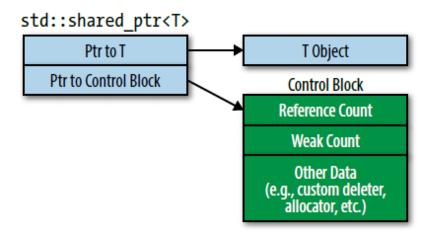

## CHAPTER 4 Smart Pointers

#### Why not original pointers?

我们可以试着枚举一些为什么原始指针很难被爱的原因：

1. 它的声明不能指示所指到底是单个对象还是数组。
2. 它的声明没有告诉你用完后是否应该销毁它，即指针是否拥有所指之物。
3. 如果你决定你应该销毁指针所指对象，没人告诉你该用`delete`还是其他析构机制（比如将指针传给专门的销毁函数）。
4. 如果你发现该用`delete`。 原因1说了可能不知道该用单个对象形式（“`delete`”）还是数组形式（“`delete[]`”）。如果用错了结果是未定义的。
5. 假设你确定了指针所指，知道销毁机制，也很难确定你在所有执行路径上都执行了**恰为一次**销毁操作（包括异常产生后的路径）。少一条路径就会产生资源泄漏，销毁多次还会导致未定义行为。
6. 一般来说没有办法告诉你指针是否变成了悬空指针（dangling pointers），即内存中不再存在指针所指之物。在对象销毁后指针仍指向它们就会产生悬空指针。

原始指针是强大的工具，当然，另一方面几十年的经验证明，只要注意力稍有疏忽，这个强大的工具就会攻击它的主人。

#### 啥是智能指针（smart pointers）

在C++11中存在四种智能指针：`std::auto_ptr`，`std::unique_ptr`，`std::shared_ptr`，` std::weak_ptr`。都是被设计用来帮助管理动态对象的生命周期，在适当的时间通过适当的方式来销毁对象，以避免出现资源泄露或者异常行为。

`std::auto_ptr`是来自C++98的已废弃遗留物，它是一次标准化的尝试，后来变成了C++11的`std::unique_ptr`。要正确的模拟原生指针需要移动语义，但是C++98没有这个东西。取而代之，`std::auto_ptr`拉拢拷贝操作来达到自己的移动意图。这导致了令人奇怪的代码（拷贝一个`std::auto_ptr`会将它本身设置为null！）和令人沮丧的使用限制（比如不能将`std::auto_ptr`放入容器）。

`std::unique_ptr`能做`std::auto_ptr`可以做的所有事情以及更多。它能高效完成任务，而且不会扭曲自己的原本含义而变成拷贝对象。在所有方面它都比`std::auto_ptr`好。现在`std::auto_ptr`唯一合法的使用场景就是代码使用C++98编译器编译。除非你有上述限制，否则你就该把`std::auto_ptr`替换为`std::unique_ptr`而且绝不回头。

### Item 18: Use `std::unique_ptr` for exclusive-ownership resource management

#### 专有所有权（*exclusive ownership*）

`std::unique_ptr`体现了专有所有权（*exclusive ownership*）语义。一个non-null `std::unique_ptr`始终拥有其指向的内容。移动一个`std::unique_ptr`将所有权从源指针转移到目的指针。（源指针被设为null。）拷贝一个`std::unique_ptr`是不允许的，因为如果你能拷贝一个`std::unique_ptr`，你会得到指向相同内容的两个`std::unique_ptr`，每个都认为自己拥有（并且应当最后销毁）资源，销毁时就会出现重复销毁。因此，`std::unique_ptr`是一种只可移动类型（*move-only type*）。当析构时，一个non-null `std::unique_ptr`销毁它指向的资源。默认情况下，资源析构通过对`std::unique_ptr`里原始指针调用`delete`来实现。

#### 自定义删除器

默认情况下，销毁将通过`delete`进行，但是在构造过程中，`std::unique_ptr`对象可以被设置为使用（对资源的）**自定义删除器**：当资源需要销毁时可调用的任意函数（或者函数对象，包括*lambda*表达式）。如果通过`makeInvestment`创建的对象不应仅仅被`delete`，而应该先写一条日志，`makeInvestment`可以以如下方式实现。（代码后有说明，别担心有些东西的动机不那么明显。）

```cpp
auto delInvmt = [](Investment* pInvestment)         //自定义删除器
                {                                   //（lambda表达式）
                    makeLogEntry(pInvestment);
                    delete pInvestment; 
                };

template<typename... Ts>
std::unique_ptr<Investment, decltype(delInvmt)>     //更改后的返回类型
makeInvestment(Ts&&... params)
{
    std::unique_ptr<Investment, decltype(delInvmt)> //应返回的指针
        pInv(nullptr, delInvmt);
    if (/*一个Stock对象应被创建*/)
    {
        pInv.reset(new Stock(std::forward<Ts>(params)...));
    }
    else if ( /*一个Bond对象应被创建*/ )   
    {     
        pInv.reset(new Bond(std::forward<Ts>(params)...));   
    }   
    else if ( /*一个RealEstate对象应被创建*/ )   
    {     
        pInv.reset(new RealEstate(std::forward<Ts>(params)...));   
    }   
    return pInv;
}
```

稍后，我将解释其工作原理，但首先请考虑如果你是调用者，情况如何。假设你存储`makeInvestment`调用结果到`auto`变量中，那么你将在愉快中忽略在删除过程中需要特殊处理的事实。当然，你确实幸福，因为使用了`unique_ptr`意味着你不需要关心什么时候资源应被释放，不需要考虑在资源释放时的路径，以及确保只释放一次，`std::unique_ptr`自动解决了这些问题。从使用者角度，`makeInvestment`接口很棒。

这个实现确实相当棒，如果你理解了：

- `delInvmt`是从`makeInvestment`返回的对象的自定义的删除器。所有的自定义的删除行为接受要销毁对象的原始指针，然后执行所有必要行为实现销毁操作。在上面情况中，操作包括调用`makeLogEntry`然后应用`delete`。使用*lambda*创建`delInvmt`是方便的，而且，正如稍后看到的，比编写常规的函数更有效。
- 当使用自定义删除器时，删除器类型必须作为第二个类型实参传给`std::unique_ptr`。在上面情况中，就是`delInvmt`的类型，这就是为什么`makeInvestment`返回类型是`std::unique_ptr<Investment, decltype(delInvmt)>`。（对于`decltype`，更多信息查看[Item3](https://cntransgroup.github.io/EffectiveModernCppChinese/1.DeducingTypes/item3.html)）
- `makeInvestment`的基本策略是创建一个空的`std::unique_ptr`，然后指向一个合适类型的对象，然后返回。为了将自定义删除器`delInvmt`与`pInv`关联，我们把`delInvmt`作为`pInv`构造函数的第二个实参。
- 尝试将原始指针（比如`new`创建）赋值给`std::unique_ptr`通不过编译，因为是一种从原始指针到智能指针的隐式转换。这种隐式转换会出问题，所以C++11的智能指针禁止这个行为。这就是通过`reset`来让`pInv`接管通过`new`创建的对象的所有权的原因。
- 使用`new`时，我们使用`std::forward`把传给`makeInvestment`的实参完美转发出去（查看[Item25](https://cntransgroup.github.io/EffectiveModernCppChinese/5.RRefMovSemPerfForw/item25.html)）。这使调用者提供的所有信息可用于正在创建的对象的构造函数。
- 自定义删除器的一个形参，类型是`Investment*`，不管在`makeInvestment`内部创建的对象的真实类型（如`Stock`，`Bond`，或`RealEstate`）是什么，它最终在*lambda*表达式中，作为`Investment*`对象被删除。这意味着我们通过基类指针删除派生类实例，为此，基类`Investment`必须有虚析构函数：

具有很多状态的自定义删除器会产生大尺寸`std::unique_ptr`对象。如果你发现自定义删除器使得你的`std::unique_ptr`变得过大，你需要审视修改你的设计。

#### 将`std::unique_ptr`转化为`std::shared_ptr`非常简单

`std::unique_ptr`是C++11中表示专有所有权的方法，但是其最吸引人的功能之一是它可以轻松高效的转换为`std::shared_ptr`：

```cpp
std::shared_ptr<Investment> sp =            //将std::unique_ptr
    makeInvestment(arguments);              //转为std::shared_ptr
```

这就是`std::unique_ptr`非常适合用作工厂函数返回类型的原因的关键部分。 工厂函数无法知道调用者是否要对它们返回的对象使用专有所有权语义，或者共享所有权（即`std::shared_ptr`）是否更合适。 通过返回`std::unique_ptr`，工厂为调用者提供了最有效的智能指针，但它们并不妨碍调用者用其更灵活的兄弟替换它。

**请记住：**

- `std::unique_ptr`是轻量级、快速的、只可移动（*move-only*）的管理专有所有权语义资源的智能指针
- 默认情况，资源销毁通过`delete`实现，但是支持自定义删除器。有状态的删除器和函数指针会增加`std::unique_ptr`对象的大小
- 将`std::unique_ptr`转化为`std::shared_ptr`非常简单

### Item 19: Use `std::shared_ptr` for shared-ownership resource management

#### 过引用计数（*reference count*）进行垃圾回收

C++11中的`std::shared_ptr`将两者组合了起来。一个通过`std::shared_ptr`访问的对象其生命周期由指向它的有共享所有权（*shared ownership*）的指针们来管理。没有特定的`std::shared_ptr`拥有该对象。相反，所有指向它的`std::shared_ptr`都能相互合作确保在它不再使用的那个点进行析构。当最后一个指向某对象的`std::shared_ptr`不再指向那（比如因为`std::shared_ptr`被销毁或者指向另一个不同的对象），`std::shared_ptr`会销毁它所指向的对象。就垃圾回收来说，客户端不需要关心指向对象的生命周期，而对象的析构是确定性的。

`std::shared_ptr`通过引用计数（*reference count*）来确保它是否是最后一个指向某种资源的指针，引用计数关联资源并跟踪有多少`std::shared_ptr`指向该资源。`std::shared_ptr`构造函数递增引用计数值（注意是**通常**——原因参见下面），析构函数递减值，拷贝赋值运算符做前面这两个工作。（如果`sp1`和`sp2`是`std::shared_ptr`并且指向不同对象，赋值“`sp1 = sp2;`”会使`sp1`指向`sp2`指向的对象。直接效果就是`sp1`引用计数减一，`sp2`引用计数加一。）如果`std::shared_ptr`在计数值递减后发现引用计数值为零，没有其他`std::shared_ptr`指向该资源，它就会销毁资源。

引用计数暗示着性能问题：

- **`std::shared_ptr`大小是原始指针的两倍**，因为它内部包含一个指向资源的原始指针，还包含一个指向资源的引用计数值的原始指针。（这种实现法并不是标准要求的，但是我（指原书作者Scott Meyers）熟悉的所有标准库都这样实现。）
- **引用计数的内存必须动态分配**。 概念上，引用计数与所指对象关联起来，但是实际上被指向的对象不知道这件事情（译注：不知道有一个关联到自己的计数值）。因此它们没有办法存放一个引用计数值。（一个好消息是任何对象——甚至是内置类型的——都可以由`std::shared_ptr`管理。）[Item21](https://cntransgroup.github.io/EffectiveModernCppChinese/4.SmartPointers/item21.html)会解释使用`std::make_shared`创建`std::shared_ptr`可以避免引用计数的动态分配，但是还存在一些`std::make_shared`不能使用的场景，这时候引用计数就会动态分配。
- **递增递减引用计数必须是原子性的**，因为多个reader、writer可能在不同的线程。比如，指向某种资源的`std::shared_ptr`可能在一个线程执行析构（于是递减指向的对象的引用计数），在另一个不同的线程，`std::shared_ptr`指向相同的对象，但是执行的却是拷贝操作（因此递增了同一个引用计数）。原子操作通常比非原子操作要慢，所以即使引用计数通常只有一个*word*大小，你也应该假定读写它们是存在开销的。

我写道`std::shared_ptr`构造函数只是“通常”递增指向对象的引用计数会不会让你有点好奇？

原因是移动构造函数的存在。从另一个`std::shared_ptr`移动构造新`std::shared_ptr`会将原来的`std::shared_ptr`设置为null，那意味着老的`std::shared_ptr`不再指向资源，同时新的`std::shared_ptr`指向资源。这样的结果就是不需要修改引用计数值。因此移动`std::shared_ptr`会比拷贝它要快：拷贝要求递增引用计数值，移动不需要。移动赋值运算符同理，所以移动构造比拷贝构造快，移动赋值运算符也比拷贝赋值运算符快。

#### 删除器类型可以是`std::shared_ptr`指针类型的一部分

类似`std::unique_ptr`（参见[Item18](https://cntransgroup.github.io/EffectiveModernCppChinese/4.SmartPointers/item18.html)），`std::shared_ptr`使用`delete`作为资源的默认销毁机制，但是它也支持自定义的删除器。这种支持有别于`std::unique_ptr`。对于`std::unique_ptr`来说，删除器类型是智能指针类型的一部分。对于`std::shared_ptr`则不是：

```CPP
auto loggingDel = [](Widget *pw)        //自定义删除器
                  {                     //（和条款18一样）
                      makeLogEntry(pw);
                      delete pw;
                  };

std::unique_ptr<                        //删除器类型是
    Widget, decltype(loggingDel)        //指针类型的一部分
    > upw(new Widget, loggingDel);
std::shared_ptr<Widget>                 //删除器类型不是
    spw(new Widget, loggingDel);        //指针类型的一部分
```

`std::shared_ptr`的设计更为灵活。考虑有两个`std::shared_ptr<Widget>`，每个自带不同的删除器（比如通过*lambda*表达式自定义删除器）：

```CPP
auto customDeleter1 = [](Widget *pw) { … };     //自定义删除器，
auto customDeleter2 = [](Widget *pw) { … };     //每种类型不同
std::shared_ptr<Widget> pw1(new Widget, customDeleter1);
std::shared_ptr<Widget> pw2(new Widget, customDeleter2);
```

因为`pw1`和`pw2`有相同的类型，所以它们都可以放到存放那个类型的对象的容器中：

```CPP
std::vector<std::shared_ptr<Widget>> vpw{ pw1, pw2 };
```

它们也能相互赋值，也可以传入一个形参为`std::shared_ptr<Widget>`的函数。但是自定义删除器类型不同的`std::unique_ptr`就不行，因为`std::unique_ptr`把删除器视作类型的一部分。

#### `std::shared_ptr`的存储结构

另一个不同于`std::unique_ptr`的地方是，指定自定义删除器不会改变`std::shared_ptr`对象的大小。不管删除器是什么，一个`std::shared_ptr`对象都是两个指针大小，但是它必须使用更多的内存。然而，那部分内存不是`std::shared_ptr`对象的一部分。那部分在堆上面，或者`std::shared_ptr`创建者利用`std::shared_ptr`对自定义分配器的支持能力，那部分内存随便在哪都行。我前面提到了`std::shared_ptr`对象包含了所指对象的引用计数的指针。没错，但是有点误导人。因为引用计数是另一个更大的数据结构的一部分，那个数据结构通常叫做**控制块**（*control block*）。每个`std::shared_ptr`管理的对象都有个相应的控制块。控制块除了包含引用计数值外还有一个自定义删除器的拷贝，当然前提是存在自定义删除器。如果用户还指定了自定义分配器，控制块也会包含一个分配器的拷贝。控制块可能还包含一些额外的数据，正如[Item21](https://cntransgroup.github.io/EffectiveModernCppChinese/4.SmartPointers/item21.html)提到的，一个次级引用计数*weak count*，但是目前我们先忽略它。我们可以想象`std::shared_ptr`对象在内存中是这样：



当指向对象的`std::shared_ptr`一创建，对象的控制块就建立了。至少我们期望是如此。通常，对于一个创建指向对象的`std::shared_ptr`的函数来说不可能知道是否有其他`std::shared_ptr`早已指向那个对象，所以控制块的创建会遵循下面几条规则：

- **`std::make_shared`（参见[Item21](https://cntransgroup.github.io/EffectiveModernCppChinese/4.SmartPointers/item21.html)）总是创建一个控制块**。它创建一个要指向的新对象，所以可以肯定`std::make_shared`调用时对象不存在其他控制块。
- **当从独占指针（即`std::unique_ptr`或者`std::auto_ptr`）上构造出`std::shared_ptr`时会创建控制块**。独占指针没有使用控制块，所以指针指向的对象没有关联控制块。（作为构造的一部分，`std::shared_ptr`侵占独占指针所指向的对象的独占权，所以独占指针被设置为null）
- **当从原始指针上构造出`std::shared_ptr`时会创建控制块**。如果你想从一个早已存在控制块的对象上创建`std::shared_ptr`，你将假定传递一个`std::shared_ptr`或者`std::weak_ptr`（参见[Item20](https://cntransgroup.github.io/EffectiveModernCppChinese/4.SmartPointers/item20.html)）作为构造函数实参，而不是原始指针。用`std::shared_ptr`或者`std::weak_ptr`作为构造函数实参创建`std::shared_ptr`不会创建新控制块，因为它可以依赖传递来的智能指针指向控制块。

这些规则造成的后果就是从原始指针上构造超过一个`std::shared_ptr`就会让你走上未定义行为的快车道，因为指向的对象有多个控制块关联。

#### 在原始指针上构造`std::shared_ptr`

多个控制块意味着多个引用计数值，多个引用计数值意味着对象将会被销毁多次（每个引用计数一次）。那意味着像下面的代码是有问题的，很有问题，问题很大：

```cpp
auto pw = new Widget;                           //pw是原始指针
…
std::shared_ptr<Widget> spw1(pw, loggingDel);   //为*pw创建控制块
…
std::shared_ptr<Widget> spw2(pw, loggingDel);   //为*pw创建第二个控制块
```

创建原始指针`pw`指向动态分配的对象很糟糕，因为它完全背离了这章的建议：倾向于使用智能指针而不是原始指针。（如果你忘记了该建议的动机，请翻到[本章开头](https://cntransgroup.github.io/EffectiveModernCppChinese/4.SmartPointers/item18.html)）。撇开那个不说，创建`pw`那一行代码虽然让人厌恶，但是至少不会造成未定义程序行为。

现在，传给`spw1`的构造函数一个原始指针，它会为指向的对象创建一个控制块（因此有个引用计数值）。这种情况下，指向的对象是`*pw`（即`pw`指向的对象）。就其本身而言没什么问题，但是将同样的原始指针传递给`spw2`的构造函数会再次为`*pw`创建一个控制块（所以也有个引用计数值）。因此`*pw`有两个引用计数值，每一个最后都会变成零，然后最终导致`*pw`销毁两次。第二个销毁会产生未定义行为。

`std::shared_ptr`给我们上了两堂课。第一，避免传给`std::shared_ptr`构造函数原始指针。通常替代方案是使用`std::make_shared`（参见[Item21](https://cntransgroup.github.io/EffectiveModernCppChinese/4.SmartPointers/item21.html)），不过上面例子中，我们使用了自定义删除器，用`std::make_shared`就没办法做到。第二，如果你必须传给`std::shared_ptr`构造函数原始指针，直接传`new`出来的结果，不要传指针变量。如果上面代码第一部分这样重写：

```cpp
std::shared_ptr<Widget> spw1(new Widget,    //直接使用new的结果
                             loggingDel);
```

会少了很多从原始指针上构造第二个`std::shared_ptr`的诱惑。相应的，创建`spw2`也会很自然的用`spw1`作为初始化参数（即用`std::shared_ptr`拷贝构造函数），那就没什么问题了：

```CPP
std::shared_ptr<Widget> spw2(spw1);         //spw2使用spw1一样的控制块
```

**请记住：**

- `std::shared_ptr`为有共享所有权的任意资源提供一种自动垃圾回收的便捷方式。
- 较之于`std::unique_ptr`，`std::shared_ptr`对象通常大两倍，控制块会产生开销，需要原子性的引用计数修改操作。
- 默认资源销毁是通过`delete`，但是也支持自定义删除器。删除器的类型是什么对于`std::shared_ptr`的类型没有影响。
- 避免从原始指针变量上创建`std::shared_ptr`。

### Item 20: Use `std::weak_ptr` for `std::shared_ptr`-like pointers that can dangle

***重点是保护线程安全！！！***

#### 为什么需要`std::weak_ptr`

1. **避免循环引用**：当两个或多个对象通过 `std::shared_ptr` 相互持有引用时，可能会形成循环引用。这会导致对象永远不会被销毁，因为它们的引用计数永远不会为零。`std::weak_ptr` 允许你打破这种循环引用，因为它不会增加引用计数，从而避免了内存泄漏。

2. **避免悬空指针**：有时候，在使用 `std::shared_ptr` 时，由于对象被提前释放，可能会导致悬空指针的问题，即指向已销毁对象的指针。`std::weak_ptr` 允许你安全地检查指向的对象是否仍然存在，从而避免了悬空指针的问题。

3. **减少对象的生命周期**：`std::weak_ptr` 不会增加对象的引用计数，因此可以在不影响对象生命周期的情况下访问对象。这对于临时需要访问对象的情况非常有用，同时不会延长对象的生命周期。

#### `std::weak_ptr`的判空和类型转化

`std::weak_ptr`不能解引用，也不能测试是否为空值。因为`std::weak_ptr`不是一个独立的智能指针。它是`std::shared_ptr`的增强。

这种关系在它创建之时就建立了。`std::weak_ptr`通常从`std::shared_ptr`上创建。当从`std::shared_ptr`上创建`std::weak_ptr`时两者指向相同的对象，但是`std::weak_ptr`不会影响所指对象的引用计数：

```cpp
auto spw =                      //spw创建之后，指向的Widget的
    std::make_shared<Widget>(); //引用计数（ref count，RC）为1。
                                //std::make_shared的信息参见条款21
…
std::weak_ptr<Widget> wpw(spw); //wpw指向与spw所指相同的Widget。RC仍为1
…
spw = nullptr;                  //RC变为0，Widget被销毁。
                                //wpw现在悬空
```

悬空的`std::weak_ptr`被称作已经**expired**（过期）。你可以用它直接做测试：

```CPP
if (wpw.expired()) …            //如果wpw没有指向对象…
```

但是通常你期望的是检查`std::weak_ptr`是否已经过期，如果没有过期则访问其指向的对象。这做起来可不是想着那么简单。因为缺少解引用操作，没有办法写这样的代码。即使有，将检查和解引用分开会引入竞态条件：在调用`expired`和解引用操作之间，另一个线程可能对指向这对象的`std::shared_ptr`重新赋值或者析构，并由此造成对象已析构。这种情况下，你的解引用将会产生未定义行为。

你需要的是一个原子操作检查`std::weak_ptr`是否已经过期，如果没有过期就访问所指对象。这可以通过从`std::weak_ptr`创建`std::shared_ptr`来实现，具体有两种形式可以从`std::weak_ptr`上创建`std::shared_ptr`，具体用哪种取决于`std::weak_ptr`过期时你希望`std::shared_ptr`表现出什么行为。一种形式是`std::weak_ptr::lock`，它返回一个`std::shared_ptr`，如果`std::weak_ptr`过期这个`std::shared_ptr`为空：

```cpp
std::shared_ptr<Widget> spw1 = wpw.lock();  //如果wpw过期，spw1就为空
 											
auto spw2 = wpw.lock();                     //同上，但是使用auto
```

另一种形式是以`std::weak_ptr`为实参构造`std::shared_ptr`。这种情况中，如果`std::weak_ptr`过期，会抛出一个异常：

```cpp
std::shared_ptr<Widget> spw3(wpw);          //如果wpw过期，抛出std::bad_weak_ptr异常
```

#### 引用循环实例

作为最后一个使用`std::weak_ptr`的例子，考虑一个持有三个对象`A`、`B`、`C`的数据结构，`A`和`C`共享`B`的所有权，因此持有`std::shared_ptr`：


假定从B指向A的指针也很有用。应该使用哪种指针？


有三种选择：

- **原始指针**。使用这种方法，如果`A`被销毁，但是`C`继续指向`B`，`B`就会有一个指向`A`的悬空指针。而且`B`不知道指针已经悬空，所以`B`可能会继续访问，就会导致未定义行为。
- **`std::shared_ptr`**。这种设计，`A`和`B`都互相持有对方的`std::shared_ptr`，导致的`std::shared_ptr`环状结构（`A`指向`B`，`B`指向`A`）阻止`A`和`B`的销毁。甚至`A`和`B`无法从其他数据结构访问了（比如，`C`不再指向`B`），每个的引用计数都还是1。如果发生了这种情况，`A`和`B`都被泄漏：程序无法访问它们，但是资源并没有被回收。
- **`std::weak_ptr`**。这避免了上述两个问题。如果`A`被销毁，`B`指向它的指针悬空，但是`B`可以检测到这件事。尤其是，尽管`A`和`B`互相指向对方，`B`的指针不会影响`A`的引用计数，因此在没有`std::shared_ptr`指向`A`时不会导致`A`无法被销毁。

使用`std::weak_ptr`显然是这些选择中最好的。但是，需要注意使用`std::weak_ptr`打破`std::shared_ptr`循环并不常见。在严格分层的数据结构比如树中，子节点只被父节点持有。当父节点被销毁时，子节点就被销毁。从父到子的链接关系可以使用`std::unique_ptr`很好的表征。从子到父的反向连接可以使用原始指针安全实现，因为子节点的生命周期肯定短于父节点。因此没有子节点解引用一个悬垂的父节点指针这样的风险。

当然，不是所有的使用指针的数据结构都是严格分层的，所以当发生这种情况时，比如上面所述缓存和观察者列表的实现之类的，知道`std::weak_ptr`随时待命也是不错的。

从效率角度来看，`std::weak_ptr`与`std::shared_ptr`基本相同。两者的大小是相同的，使用相同的控制块（参见[Item19](https://cntransgroup.github.io/EffectiveModernCppChinese/4.SmartPointers/item19.html)），构造、析构、赋值操作涉及引用计数的原子操作。这可能让你感到惊讶，因为本条款开篇就提到`std::weak_ptr`不影响引用计数。我写的是`std::weak_ptr`不参与对象的**共享所有权**，因此不影响**指向对象的引用计数**。实际上在控制块中还是有第二个引用计数，`std::weak_ptr`操作的是第二个引用计数

**请记住：**

- 用`std::weak_ptr`替代可能会悬空的`std::shared_ptr`。
- `std::weak_ptr`的潜在使用场景包括：缓存、观察者列表、打破`std::shared_ptr`环状结构。

### Item 21: Prefer `std::make_unique` and `std::make_shared` to direct use of `new`

`std::make_unique`和`std::make_shared`是三个**make函数** 中的两个：接收任意的多参数集合，完美转发到构造函数去动态分配一个对象，然后返回这个指向这个对象的指针。第三个`make`函数是`std::allocate_shared`。它行为和`std::make_shared`一样，只不过第一个参数是用来动态分配内存的*allocator*对象。

#### 减少重复对象名

即使通过用和不用`make`函数来创建智能指针的一个小小比较，也揭示了为何使用`make`函数更好的第一个原因。例如：

```c++
auto upw1(std::make_unique<Widget>());      //使用make函数
std::unique_ptr<Widget> upw2(new Widget);   //不使用make函数
auto spw1(std::make_shared<Widget>());      //使用make函数
std::shared_ptr<Widget> spw2(new Widget);   //不使用make函数
```

我高亮了关键区别：使用`new`的版本重复了类型，但是`make`函数的版本没有。（译者注：这里高亮的是`Widget`，用`new`的声明语句需要写2遍`Widget`，`make`函数只需要写一次。）重复写类型和软件工程里面一个关键原则相冲突：应该避免重复代码。源代码中的重复增加了编译的时间，会导致目标代码冗余，并且通常会让代码库使用更加困难。它经常演变成不一致的代码，而代码库中的不一致常常导致bug。此外，打两次字比一次更费力，而且没人不喜欢少打字吧？

#### 保护编译异常安全

第二个使用`make`函数的原因和异常安全有关。假设我们有个函数按照某种优先级处理`Widget`：

```c++
void processWidget(std::shared_ptr<Widget> spw, int priority);
```

值传递`std::shared_ptr`可能看起来很可疑，但是[Item41](https://cntransgroup.github.io/EffectiveModernCppChinese/8.Tweaks/item41.html)解释了，如果`processWidget`总是复制`std::shared_ptr`（例如，通过将其存储在已处理的`Widget`的一个数据结构中），那么这可能是一个合理的设计选择。

现在假设我们有一个函数来计算相关的优先级，

```c++
int computePriority();
```

并且我们在调用`processWidget`时使用了`new`而不是`std::make_shared`：

```c++
processWidget(std::shared_ptr<Widget>(new Widget),  //潜在的资源泄漏！
              computePriority());
```

如注释所说，这段代码可能在`new`一个`Widget`时发生泄漏。为何？调用的代码和被调用的函数都用`std::shared_ptr`s，且`std::shared_ptr`s就是设计出来防止泄漏的。它们会在最后一个`std::shared_ptr`销毁时自动释放所指向的内存。如果每个人在每个地方都用`std::shared_ptr`s，这段代码怎么会泄漏呢？

答案和编译器将源码转换为目标代码有关。在运行时，一个函数的实参必须先被计算，这个函数再被调用，所以在调用`processWidget`之前，必须执行以下操作，`processWidget`才开始执行：

- 表达式“`new Widget`”必须计算，例如，一个`Widget`对象必须在堆上被创建
- 负责管理`new`出来指针的`std::shared_ptr<Widget>`构造函数必须被执行
- `computePriority`必须运行

编译器不需要按照执行顺序生成代码。“`new Widget`”必须在`std::shared_ptr`的构造函数被调用前执行，因为`new`出来的结果作为构造函数的实参，但`computePriority`可能在这之前，之后，或者**之间**执行。也就是说，编译器可能按照这个执行顺序生成代码：

1. 执行“`new Widget`”
2. 执行`computePriority`
3. 运行`std::shared_ptr`构造函数

如果按照这样生成代码，并且在运行时`computePriority`产生了异常，那么第一步动态分配的`Widget`就会泄漏。因为它永远都不会被第三步的`std::shared_ptr`所管理了。

使用`std::make_shared`可以防止这种问题。调用代码看起来像是这样：

```c++
processWidget(std::make_shared<Widget>(),   //没有潜在的资源泄漏
              computePriority());
```

在运行时，`std::make_shared`和`computePriority`其中一个会先被调用。如果是`std::make_shared`先被调用，在`computePriority`调用前，动态分配`Widget`的原始指针会安全的保存在作为返回值的`std::shared_ptr`中。如果`computePriority`产生一个异常，那么`std::shared_ptr`析构函数将确保管理的`Widget`被销毁。如果首先调用`computePriority`并产生一个异常，那么`std::make_shared`将不会被调用，因此也就不需要担心动态分配`Widget`（会泄漏）。

#### 提高分配效率

`std::make_shared`的一个特性（与直接使用`new`相比）是效率提升。使用`std::make_shared`允许编译器生成更小，更快的代码，并使用更简洁的数据结构。考虑以下对new的直接使用：

```c++
std::shared_ptr<Widget> spw(new Widget);
```

显然，这段代码需要进行内存分配，但它实际上执行了两次。[Item19](https://cntransgroup.github.io/EffectiveModernCppChinese/4.SmartPointers/item19.html)解释了每个`std::shared_ptr`指向一个控制块，其中包含被指向对象的引用计数，还有其他东西。这个控制块的内存在`std::shared_ptr`构造函数中分配。因此，直接使用`new`需要为`Widget`进行一次内存分配，为控制块再进行一次内存分配。

如果使用`std::make_shared`代替：

```c++
auto spw = std::make_shared<Widget>();
```

一次分配足矣。这是因为`std::make_shared`分配一块内存，同时容纳了`Widget`对象和控制块。这种优化减少了程序的静态大小，因为代码只包含一个内存分配调用，并且它提高了可执行代码的速度，因为内存只分配一次。此外，使用`std::make_shared`避免了对控制块中的某些簿记信息的需要，潜在地减少了程序的总内存占用。

#### `make_*`函数的使用限制

例如，`make`函数都**不允许指定自定义删除器**（见[Item18](https://cntransgroup.github.io/EffectiveModernCppChinese/4.SmartPointers/item18.html)和[19](https://cntransgroup.github.io/EffectiveModernCppChinese/4.SmartPointers/item19.html)），但是`std::unique_ptr`和`std::shared_ptr`有构造函数这么做。有个`Widget`的自定义删除器：

```cpp
auto widgetDeleter = [](Widget* pw) { … };
```

创建一个使用它的智能指针只能直接使用`new`：

```cpp
std::unique_ptr<Widget, decltype(widgetDeleter)>
    upw(new Widget, widgetDeleter);

std::shared_ptr<Widget> spw(new Widget, widgetDeleter);
```

`make`函数第二个限制来自于其实现中的语法细节。[Item7](https://cntransgroup.github.io/EffectiveModernCppChinese/3.MovingToModernCpp/item7.html)解释了，当构造函数重载，有使用`std::initializer_list`作为参数的重载形式和不用其作为参数的的重载形式，用花括号创建的对象更倾向于使用`std::initializer_list`作为形参的重载形式，而用小括号创建对象将调用不用`std::initializer_list`作为参数的的重载形式。`make`函数会将它们的参数完美转发给对象构造函数，但是它们是使用小括号还是花括号？对某些类型，问题的答案会很不相同。例如，在这些调用中，

```cpp
auto upv = std::make_unique<std::vector<int>>(10, 20);
auto spv = std::make_shared<std::vector<int>>(10, 20);
```

生成的智能指针指向带有10个元素的`std::vector`，每个元素值为20，还是指向带有两个元素的`std::vector`，其中一个元素值10，另一个为20？或者结果是不确定的？

好消息是这并非不确定：两种调用都创建了10个元素，每个值为20的`std::vector`。这意味着在`make`函数中，完美转发使用小括号，而不是花括号。坏消息是如果你想用花括号初始化指向的对象，你必须直接使用`new`。使用`make`函数会需要能够完美转发花括号初始化的能力，但是，正如[Item30](https://cntransgroup.github.io/EffectiveModernCppChinese/5.RRefMovSemPerfForw/item30.html)所说，花括号初始化无法完美转发。但是，[Item30](https://cntransgroup.github.io/EffectiveModernCppChinese/5.RRefMovSemPerfForw/item30.html)介绍了一个变通的方法：使用`auto`类型推导从花括号初始化创建`std::initializer_list`对象（见[Item2](https://cntransgroup.github.io/EffectiveModernCppChinese/1.DeducingTypes/item2.html)），然后将`auto`创建的对象传递给`make`函数。

```cpp
//创建std::initializer_list
auto initList = { 10, 20 };
//使用std::initializer_list为形参的构造函数创建std::vector
auto spv = std::make_shared<std::vector<int>>(initList);
```

对于`std::unique_ptr`，只有这两种情景（自定义删除器和花括号初始化）使用`make`函数有点问题。对于`std::shared_ptr`和它的`make`函数，还有2个问题。都属于边缘情况，但是一些开发者常碰到，你也可能是其中之一。

#### 不适合`std::shared_ptr`的情况

与直接使用`new`相比，`std::make_shared`在大小和速度上的优势源于`std::shared_ptr`的控制块与指向的对象放在同一块内存中。当对象的引用计数降为0，对象被销毁（即析构函数被调用）。但是，因为控制块和对象被放在同一块分配的内存块中，直到控制块的内存也被销毁，对象占用的内存才被释放。

只要`std::weak_ptr`s引用一个控制块（即*weak count*大于零），该控制块必须继续存在。只要控制块存在，包含它的内存就必须保持分配。通过`std::shared_ptr`的`make`函数分配的内存，直到最后一个`std::shared_ptr`和最后一个指向它的`std::weak_ptr`已被销毁，才会释放。

如果对象类型非常大，而且销毁最后一个`std::shared_ptr`和销毁最后一个`std::weak_ptr`之间的时间很长，那么在销毁对象和释放它所占用的内存之间可能会出现延迟。

直接只用`new`，一旦最后一个`std::shared_ptr`被销毁，`ReallyBigType`对象的内存就会被释放

**请记住：**

- 和直接使用`new`相比，`make`函数消除了代码重复，提高了异常安全性。对于`std::make_shared`和`std::allocate_shared`，生成的代码更小更快。
- 不适合使用`make`函数的情况包括需要指定自定义删除器和希望用花括号初始化。
- 对于`std::shared_ptr`s，其他不建议使用`make`函数的情况包括(1)有自定义内存管理的类；(2)特别关注内存的系统，非常大的对象，以及`std::weak_ptr`s比对应的`std::shared_ptr`s活得更久。

### Item 22: When using the Pimpl Idiom, define special member functions in the implementation file

#### 什么是Pimpl（Pointer to Implementation）

Pimpl（Pointer to Implementation）惯用法是一种常见的C++编程技巧，用于减少类的实现与类使用者之间的编译依赖。通过Pimpl，可以将类的数据成员替换为指向包含具体实现的类（或结构体）的指针，从而将类的实现细节与其接口隔离开来。这种做法有助于减少编译时间、降低类使用者的依赖性，并且使得对类的实现进行修改时，对类使用者的影响降到最低。

#### `std::unique_ptr`在Pimpl惯用法上的使用缺陷

这一章建立在“智能指针比原始指针更好”的主题上，并且，如果我们想要的只是在类`Widget`的构造函数动态分配`Widget::impl`对象，在`Widget`对象销毁时一并销毁它， `std::unique_ptr`（见[Item18](https://cntransgroup.github.io/EffectiveModernCppChinese/4.SmartPointers/item18.html)）是最合适的工具。在头文件中用`std::unique_ptr`替代原始指针，就有了头文件中如下代码:

```cpp
class Widget {                      //在“widget.h”中
public:
    Widget();
    …

private:
    struct Impl;
    std::unique_ptr<Impl> pImpl;    //使用智能指针而不是原始指针
};
```

实现文件也可以改成如下：

```cpp
#include "widget.h"                 //在“widget.cpp”中
#include "gadget.h"
#include <string>
#include <vector>

struct Widget::Impl {               //跟之前一样
    std::string name;
    std::vector<double> data;
    Gadget g1,g2,g3;
};

Widget::Widget()                    //根据条款21，通过std::make_unique
: pImpl(std::make_unique<Impl>())   //来创建std::unique_ptr
{}
```

你会注意到，`Widget`的析构函数不存在了。这是因为我们没有代码加在里面了。 `std::unique_ptr`在自身析构时，会自动销毁它所指向的对象，所以我们自己无需手动销毁任何东西。这就是智能指针的众多优点之一：它使我们从手动资源释放中解放出来。

以上的代码能编译，但是，最普通的`Widget`用法却会导致编译出错：

```cpp
#include "widget.h"

Widget w;                           //错误！
```

你所看到的错误信息根据编译器不同会有所不同，但是其文本一般会提到一些有关于“把`sizeof`或`delete`应用到不完整类型上”的信息。对于不完整类型，使用以上操作是禁止的。

在Pimpl惯用法中使用`std::unique_ptr`会抛出错误，有点惊悚，因为第一`std::unique_ptr`宣称它支持不完整类型，第二Pimpl惯用法是`std::unique_ptr`的最常见的使用情况之一。 幸运的是，让这段代码能正常运行很简单。 只需要对上面出现的问题的原因有一个基础的认识就可以了。

在对象`w`被析构时（例如离开了作用域），问题出现了。在这个时候，它的析构函数被调用。我们在类的定义里使用了`std::unique_ptr`，所以我们没有声明一个析构函数，因为我们并没有任何代码需要写在里面。根据编译器自动生成的特殊成员函数的规则（见 [Item17](https://cntransgroup.github.io/EffectiveModernCppChinese/3.MovingToModernCpp/item17.html)），编译器会自动为我们生成一个析构函数。 在这个析构函数里，编译器会插入一些代码来调用类`Widget`的数据成员`pImpl`的析构函数。 `pImpl`是一个`std::unique_ptr<Widget::Impl>`，也就是说，一个使用默认删除器的`std::unique_ptr`。 默认删除器是一个函数，它使用`delete`来销毁内置于`std::unique_ptr`的原始指针。然而，在使用`delete`之前，通常会使默认删除器使用C++11的特性`static_assert`来确保原始指针指向的类型不是一个不完整类型。 当编译器为`Widget w`的析构生成代码时，它会遇到`static_assert`检查并且失败，这通常是错误信息的来源。 这些错误信息只在对象`w`销毁的地方出现，因为类`Widget`的析构函数，正如其他的编译器生成的特殊成员函数一样，是暗含`inline`属性的。 错误信息自身往往指向对象`w`被创建的那行，因为这行代码明确地构造了这个对象，导致了后面潜在的析构。

为了解决这个问题，你只需要确保在编译器生成销毁`std::unique_ptr<Widget::Impl>`的代码之前， `Widget::Impl`已经是一个完整类型（*complete type*）。 当编译器“看到”它的定义的时候，该类型就成为完整类型了。 但是 `Widget::Impl`的定义在`widget.cpp`里。成功编译的关键，就是在`widget.cpp`文件内，让编译器在“看到” `Widget`的析构函数实现之前（也即编译器插入的，用来销毁`std::unique_ptr`这个数据成员的代码的，那个位置），先定义`Widget::Impl`。

出这样的调整很容易。只需要先在`widget.h`里，只声明类`Widget`的析构函数，但不要在这里定义它：

```cpp
class Widget {                  //跟之前一样，在“widget.h”中
public:
    Widget();
    ~Widget();                  //只有声明语句
    …

private:                        //跟之前一样
    struct Impl;
    std::unique_ptr<Impl> pImpl;
};
```

在`widget.cpp`文件中，在结构体`Widget::Impl`被定义之后，再定义析构函数：

```cpp
#include "widget.h"                 //跟之前一样，在“widget.cpp”中
#include "gadget.h"
#include <string>
#include <vector>

struct Widget::Impl {               //跟之前一样，定义Widget::Impl
    std::string name;
    std::vector<double> data;
    Gadget g1,g2,g3;
}

Widget::Widget()                    //跟之前一样
: pImpl(std::make_unique<Impl>())
{}

Widget::~Widget()                   //析构函数的定义（译者注：这里高亮）
{}
```

这样就可以了，并且这样增加的代码也最少

`std::unique_ptr`和`std::shared_ptr`在`pImpl`指针上的表现上的区别的深层原因在于，他们支持自定义删除器的方式不同。 对`std::unique_ptr`而言，删除器的类型是这个智能指针的一部分，这让编译器有可能生成更小的运行时数据结构和更快的运行代码。 这种更高效率的后果之一就是`std::unique_ptr`指向的类型，在编译器的生成特殊成员函数（如析构函数，移动操作）被调用时，必须已经是一个完整类型。 而对`std::shared_ptr`而言，删除器的类型不是该智能指针的一部分，这让它会生成更大的运行时数据结构和稍微慢点的代码，但是当编译器生成的特殊成员函数被使用的时候，指向的对象不必是一个完整类型。（译者注：知道`std::unique_ptr`和`std::shared_ptr`的实现，这一段才比较容易理解。）

对于Pimpl惯用法而言，在`std::unique_ptr`和`std::shared_ptr`的特性之间，没有一个比较好的折中。 因为对于像`Widget`的类以及像`Widget::Impl`的类之间的关系而言，他们是独享占有权关系，这让`std::unique_ptr`使用起来很合适。 然而，有必要知道，在其他情况中，当共享所有权存在时，`std::shared_ptr`是很适用的选择的时候，就没有`std::unique_ptr`所必需的声明——定义（function-definition）这样的麻烦事了。

**请记住：**

- Pimpl惯用法通过减少在类实现和类使用者之间的编译依赖来减少编译时间。
- 对于`std::unique_ptr`类型的`pImpl`指针，需要在头文件的类里声明特殊的成员函数，但是在实现文件里面来实现他们。即使是编译器自动生成的代码可以工作，也要这么做。
- 以上的建议只适用于`std::unique_ptr`，不适用于`std::shared_ptr`。