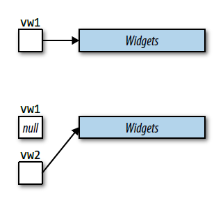
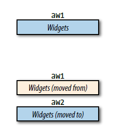

## CHAPTER 5 RValue References, Move Semantics and Perfect Forwarding

当你第一次了解到移动语义（*move semantics*）和完美转发（*perfect forwarding*）的时候，它们看起来非常直观：

- **移动语义**使编译器有可能用廉价的移动操作来代替昂贵的拷贝操作。正如拷贝构造函数和拷贝赋值操作符给了你控制拷贝语义的权力，移动构造函数和移动赋值操作符也给了你控制移动语义的权力。移动语义也允许创建只可移动（*move-only*）的类型，例如`std::unique_ptr`，`std::future`和`std::thread`。
- **完美转发**使接收任意数量实参的函数模板成为可能，它可以将实参转发到其他的函数，使目标函数接收到的实参与被传递给转发函数的实参保持一致。

**右值引用**是连接这两个截然不同的概念的胶合剂。它是使移动语义和完美转发变得可能的基础语言机制。

### Item 23: Understand `std::move` and `std::forward`

#### `std::move`可能会被隐式转化成拷贝操作

假设你有一个类，它用来表示一段注解。这个类的构造函数接受一个包含有注解的`std::string`作为形参，然后它复制该形参到数据成员。当复制`text`到一个数据成员的时候，为了避免一次复制操作的代价，你仍然记得来自[Item41](https://cntransgroup.github.io/EffectiveModernCppChinese/8.Tweaks/item41.html)的建议，把`std::move`应用到`text`上，因此产生一个右值：

```cpp
class Annotation {
public:
    explicit Annotation(const std::string text)
    ：value(std::move(text))    //“移动”text到value里；这段代码执行起来
    { … }                       //并不是看起来那样
    
    …

private:
    std::string value;
};
```

这段代码可以编译，可以链接，可以运行。这段代码将数据成员`value`设置为`text`的值。这段代码与你期望中的完美实现的唯一区别，是`text`并不是被移动到`value`，而是被**拷贝**。诚然，`text`通过`std::move`被转换到右值，但是`text`被声明为`const std::string`，所以在转换之前，`text`是一个左值的`const std::string`，而转换的结果是一个右值的`const std::string`，但是纵观全程，`const`属性一直保留。

当编译器决定哪一个`std::string`的构造函数被调用时，考虑它的作用，将会有两种可能性：

```cpp
class string {                  //std::string事实上是
public:                         //std::basic_string<char>的类型别名
    …
    string(const string& rhs);  //拷贝构造函数
    string(string&& rhs);       //移动构造函数
    …
};
```

在类`Annotation`的构造函数的成员初始化列表中，`std::move(text)`的结果是一个`const std::string`的右值。这个右值不能被传递给`std::string`的移动构造函数，因为移动构造函数只接受一个指向**non-`const`\**的`std::string`的右值引用。然而，该右值却可以被传递给`std::string`的拷贝构造函数，因为lvalue-reference-to-`const`允许被绑定到一个`const`右值上。因此，`std::string`在成员初始化的过程中调用了\**拷贝**构造函数，即使`text`已经被转换成了右值。这样是为了确保维持`const`属性的正确性。从一个对象中移动出某个值通常代表着修改该对象，所以语言不允许`const`对象被传递给可以修改他们的函数（例如移动构造函数）。

从这个例子中，可以总结出两点：

1. 第一，不要在你希望能移动对象的时候，声明他们为`const`。对`const`对象的移动请求会悄无声息的被转化为拷贝操作。 
2. 二点，`std::move`不仅不移动任何东西，而且它也不保证它执行转换的对象可以被移动。

关于`std::move`，你能确保的唯一一件事就是将它应用到一个对象上，你能够得到一个右值。

#### `std::forward`是**有条件**的转换

要明白什么时候它执行转换，什么时候不，想想`std::forward`的典型用法。最常见的情景是一个模板函数，接收一个通用引用形参，并将它传递给另外的函数：

```cpp
void process(const Widget& lvalArg);        //处理左值
void process(Widget&& rvalArg);             //处理右值

template<typename T>                        //用以转发param到process的模板
void logAndProcess(T&& param)
{
    auto now =                              //获取现在时间
        std::chrono::system_clock::now();
    
    makeLogEntry("Calling 'process'", now);
    process(std::forward<T>(param));
}
```

考虑两次对`logAndProcess`的调用，一次左值为实参，一次右值为实参：

```cpp
Widget w;

logAndProcess(w);               //用左值调用
logAndProcess(std::move(w));    //用右值调用
```

在`logAndProcess`函数的内部，形参`param`被传递给函数`process`。函数`process`分别对左值和右值做了重载。当我们使用左值来调用`logAndProcess`时，自然我们期望该左值被当作左值转发给`process`函数，而当我们使用右值来调用`logAndProcess`函数时，我们期望`process`函数的右值重载版本被调用。

但是`param`，正如所有的其他函数形参一样，是一个左值。每次在函数`logAndProcess`内部对函数`process`的调用，都会因此调用函数`process`的左值重载版本。为防如此，我们需要一种机制：当且仅当传递给函数`logAndProcess`的用以初始化`param`的实参是一个右值时，`param`会被转换为一个右值。这就是`std::forward`做的事情。这就是为什么`std::forward`是一个**有条件**的转换：它的实参用右值初始化时，转换为一个右值。

**主要矛盾在于：如果直接用`process(param)`那么当`param`是右值引用的时候，`process`会将其识别为左值调用相应的重载函数**

**请记住：**

- `std::move`执行到右值的无条件的转换，但就自身而言，它不移动任何东西。
- `std::forward`只有当它的参数被绑定到一个右值时，才将参数转换为右值。
- `std::move`和`std::forward`在运行期什么也不做。

### Item 24: Distinguish universal references from rvalue references

#### `T&&`可以是右值引用也可以是通用引用

为了声明一个指向某个类型`T`的右值引用，你写下了`T&&`。由此，一个合理的假设是，当你看到一个“`T&&`”出现在源码中，你看到的是一个右值引用。唉，事情并不如此简单:

```cpp
void f(Widget&& param);             //右值引用
Widget&& var1 = Widget();           //右值引用
auto&& var2 = var1;                 //不是右值引用

template<typename T>
void f(std::vector<T>&& param);     //右值引用

template<typename T>
void f(T&& param);                  //不是右值引用
```

事实上，“`T&&`”有两种不同的意思。第一种，当然是右值引用。这种引用表现得正如你所期待的那样：它们只绑定到右值上，并且它们主要的存在原因就是为了识别可以移动操作的对象。

“`T&&`”的另一种意思是，它既可以是右值引用，也可以是左值引用。这种引用在源码里看起来像右值引用（即“`T&&`”），但是它们可以表现得像是左值引用（即“`T&`”）。它们的二重性使它们既可以绑定到右值上（就像右值引用），也可以绑定到左值上（就像左值引用）。 此外，它们还可以绑定到`const`或者non-`const`的对象上，也可以绑定到`volatile`或者non-`volatile`的对象上，甚至可以绑定到既`const`又`volatile`的对象上。它们可以绑定到几乎任何东西。这种空前灵活的引用值得拥有自己的名字。我把它叫做**通用引用**（*universal references*）。（[Item25](https://cntransgroup.github.io/EffectiveModernCppChinese/5.RRefMovSemPerfForw/item25.html)解释了`std::forward`几乎总是可以应用到通用引用上，并且在这本书即将出版之际，一些C++社区的成员已经开始将这种通用引用称之为**转发引用**（*forwarding references*））。

在两种情况下会出现通用引用。最常见的一种是函数模板形参，正如在之前的示例代码中所出现的例子：

```cpp
template<typename T>
void f(T&& param);                  //param是一个通用引用
```

第二种情况是`auto`声明符，它是从以上示例中拿出的：

```cpp
auto&& var2 = var1;                 //var2是一个通用引用
```

这两种情况的共同之处就是都存在**类型推导**（*type deduction*）。

#### 通用引用必需类型推导

对一个通用引用而言，类型推导是必要的，但是它还不够。引用声明的**形式**必须正确，并且该形式是被限制的。它必须恰好为“`T&&`”。再看看之前我们已经看过的代码示例：

```cpp
template <typename T>
void f(std::vector<T>&& param);     //param是一个右值引用
```

当函数`f`被调用的时候，类型`T`会被推导（除非调用者显式地指定它，这种边缘情况我们不考虑）。但是`param`的类型声明并不是`T&&`，而是一个`std::vector<T>&&`。这排除了`param`是一个通用引用的可能性。`param`因此是一个右值引用——当你向函数`f`传递一个左值时，你的编译器将会乐于帮你确认这一点:

```cpp
std::vector<int> v;
f(v);                           //错误！不能将左值绑定到右值引用
```

即使一个简单的`const`修饰符的出现，也足以使一个引用失去成为通用引用的资格:

```cpp
template <typename T>
void f(const T&& param);        //param是一个右值引用
```

如果你在一个模板里面看见了一个函数形参类型为“`T&&`”，你也许觉得你可以假定它是一个通用引用。错！这是由于在模板内部并不保证一定会发生类型推导。考虑如下`push_back`成员函数，来自`std::vector`：

```cpp
template<class T, class Allocator = allocator<T>>   //来自C++标准
class vector
{
public:
    void push_back(T&& x);
    …
}
```

`push_back`函数的形参当然有一个通用引用的正确形式，然而，在这里并没有发生类型推导。因为`push_back`在有一个特定的`vector`实例之前不可能存在，而实例化`vector`时的类型已经决定了`push_back`的声明。也就是说，

```cpp
std::vector<Widget> v;
```

将会导致`std::vector`模板被实例化为以下代码：

```cpp
class vector<Widget, allocator<Widget>> {
public:
    void push_back(Widget&& x);             //右值引用
    …
};
```

现在你可以清楚地看到，函数`push_back`不包含任何类型推导。`push_back`对于`vector<T>`而言（有两个函数——它被重载了）总是声明了一个类型为rvalue-reference-to-`T`的形参。

作为对比，`std::vector`内的概念上相似的成员函数`emplace_back`，却确实包含类型推导:

```cpp
template<class T, class Allocator = allocator<T>>   //依旧来自C++标准
class vector {
public:
    template <class... Args>
    void emplace_back(Args&&... args);
    …
};
```

这儿，类型参数（*type parameter*）`Args`是独立于`vector`的类型参数`T`的，所以`Args`会在每次`emplace_back`被调用的时候被推导。（好吧，`Args`实际上是一个[*parameter pack*](https://en.cppreference.com/w/cpp/language/parameter_pack)，而不是一个类型参数，但是为了方便讨论，我们可以把它当作是一个类型参数。）

虽然函数`emplace_back`的类型参数被命名为`Args`，但是它仍然是一个通用引用，这补充了我之前所说的，通用引用的格式必须是“`T&&`”。你使用的名字`T`并不是必要的。举个例子，如下模板接受一个通用引用，因为形式（“`type&&`”）是正确的，并且`param`的类型将会被推导（重复一次，不考虑边缘情况，即当调用者明确给定类型的时候）。

**请记住：**

- 如果一个函数模板形参的类型为`T&&`，并且`T`需要被推导得知，或者如果一个对象被声明为`auto&&`，这个形参或者对象就是一个通用引用。
- 如果类型声明的形式不是标准的`type&&`，或者如果类型推导没有发生，那么`type&&`代表一个右值引用。
- 通用引用，如果它被右值初始化，就会对应地成为右值引用；如果它被左值初始化，就会成为左值引用。

### Item 25: Use `std::move` on rvalue references, `std::forward` on universal references

这一个条款比较偏向高性能优化，与编译器的行为相关较大，正常开发不太有关，故不做深究

**请记住：**

- 最后一次使用时，在右值引用上使用`std::move`，在通用引用上使用`std::forward`。
- 对按值返回的函数要返回的右值引用和通用引用，执行相同的操作。
- 如果局部对象可以被返回值优化消除，就绝不使用`std::move`或者`std::forward`。

### Item 26: Avoid overloading on universal references

#### 通用引用使用移动操作来避免拷贝操作

假定你需要写一个函数，它使用名字作为形参，打印当前日期和时间到日志中，然后将名字加入到一个全局数据结构中。你可能写出来这样的代码：

```cpp
std::multiset<std::string> names;           //全局数据结构
void logAndAdd(const std::string& name)
{
    auto now =                              //获取当前时间
        std::chrono::system_clock::now();
    log(now, "logAndAdd");                  //志记信息
    names.emplace(name);                    //把name加到全局数据结构中；
}                                           //emplace的信息见条款42
```

这份代码没有问题，但是同样的也没有效率。考虑这三个调用：

```cpp
std::string petName("Darla");
logAndAdd(petName);                     //传递左值std::string
logAndAdd(std::string("Persephone"));	//传递右值std::string
logAndAdd("Patty Dog");                 //传递字符串字面值
```

在第一个调用中，`logAndAdd`的形参`name`绑定到变量`petName`。在`logAndAdd`中`name`最终传给`names.emplace`。因为`name`是左值，会拷贝到`names`中。没有方法避免拷贝，因为是左值（`petName`）传递给`logAndAdd`的。

在第二个调用中，形参`name`绑定到右值（显式从“`Persephone`”创建的临时`std::string`）。`name`本身是个左值，所以它被拷贝到`names`中，但是我们意识到，原则上，它的值可以被移动到`names`中。本次调用中，我们有个拷贝代价，但是我们应该能用移动勉强应付。

在第三个调用中，形参`name`也绑定一个右值，但是这次是通过“`Patty Dog`”隐式创建的临时`std::string`变量。就像第二个调用中，`name`被拷贝到`names`，但是这里，传递给`logAndAdd`的实参是一个字符串字面量。如果直接将字符串字面量传递给`emplace`，就不会创建`std::string`的临时变量，而是直接在`std::multiset`中通过字面量构建`std::string`。在第三个调用中，我们有个`std::string`拷贝开销，但是我们连移动开销都不想要，更别说拷贝的。

我们可以通过使用通用引用（参见[Item24](https://cntransgroup.github.io/EffectiveModernCppChinese/5.RRefMovSemPerfForw/item24.html)）重写`logAndAdd`来使第二个和第三个调用效率提升，按照[Item25](https://cntransgroup.github.io/EffectiveModernCppChinese/5.RRefMovSemPerfForw/item25.html)的说法，`std::forward`转发这个引用到`emplace`。代码如下：

```cpp
template<typename T>
void logAndAdd(T&& name)
{
    auto now = std::chrono::system_clock::now();
    log(now, "logAndAdd");
    names.emplace(std::forward<T>(name));
}

std::string petName("Darla");           //跟之前一样
logAndAdd(petName);                     //跟之前一样，拷贝左值到multiset
logAndAdd(std::string("Persephone"));	//移动右值而不是拷贝它
logAndAdd("Patty Dog");                 //在multiset直接创建std::string
                                        //而不是拷贝一个临时std::string
```

非常好，效率优化了！

#### 通用引用形参的函数进行重载会导致该函数优先级高于正确调用形式

使用通用引用的函数在C++中是最贪婪的函数。它们几乎可以精确匹配任何类型的实参（极少不适用的实参在[Item30](https://cntransgroup.github.io/EffectiveModernCppChinese/5.RRefMovSemPerfForw/item30.html)中介绍）。这也是把重载和通用引用组合在一块是糟糕主意的原因：通用引用的实现会匹配比开发者预期要多得多的实参类型。

假如我们的`logAndAdd`需要重载为：

```cpp
std::string nameFromIdx(int idx);   //返回idx对应的名字

void logAndAdd(int idx)             //新的重载
{
    auto now = std::chrono::system_clock::now();
    log(now, "logAndAdd");
    names.emplace(nameFromIdx(idx));
}
```

事实上，这只能基本按照预期工作，假定一个客户将`short`类型索引传递给`logAndAdd`：

```cpp
short nameIdx;
…                                       //给nameIdx一个值
logAndAdd(nameIdx);                     //错误！
```

有两个重载的`logAndAdd`。使用通用引用的那个推导出`T`的类型是`short`，因此可以精确匹配。对于`int`类型参数的重载也可以在`short`类型提升后匹配成功。根据正常的重载解决规则，精确匹配优先于类型提升的匹配，所以被调用的是通用引用的重载。

在通用引用那个重载中，`name`形参绑定到要传入的`short`上，然后`name`被`std::forward`给`names`（一个`std::multiset<std::string>`）的`emplace`成员函数，然后又被转发给`std::string`构造函数。`std::string`没有接受`short`的构造函数，所以`logAndAdd`调用里的`multiset::emplace`调用里的`std::string`构造函数调用失败。（译者注：这句话比较绕，实际上就是调用链。）所有这一切的原因就是对于`short`类型通用引用重载优先于`int`类型的重载。

一个更容易掉入这种陷阱的例子是写一个完美转发构造函数。简单对`logAndAdd`例子进行改造就可以说明这个问题。不用写接受`std::string`或者用索引查找`std::string`的自由函数，只是想一个构造函数有着相同操作的`Person`类：

```cpp
class Person {
public:
    template<typename T>
    explicit Person(T&& n)              //完美转发的构造函数，初始化数据成员
    : name(std::forward<T>(n)) {}

    explicit Person(int idx)            //int的构造函数
    : name(nameFromIdx(idx)) {}
    …

private:
    std::string name;
};
```

就像在`logAndAdd`的例子中，传递一个不是`int`的整型变量（比如`std::size_t`，`short`，`long`等）会调用通用引用的构造函数而不是`int`的构造函数，这会导致编译错误。这里这个问题甚至更糟糕，因为`Person`中存在的重载比肉眼看到的更多。

**请记住：**

- 对通用引用形参的函数进行重载，通用引用函数的调用机会几乎总会比你期望的多得多。
- 完美转发构造函数是糟糕的实现，因为对于non-`const`左值，它们比拷贝构造函数而更匹配，而且会劫持派生类对于基类的拷贝和移动构造函数的调用。

### Item 27: Familiarize yourself with alternatives to overloading on universal references

#### 放弃重载

在[Item26](https://cntransgroup.github.io/EffectiveModernCppChinese/5.RRefMovSemPerfForw/item26.html)中的第一个例子中，`logAndAdd`是许多函数的代表，这些函数可以使用不同的名字来避免在通用引用上的重载的弊端。例如两个重载的`logAndAdd`函数，可以分别改名为`logAndAddName`和`logAndAddNameIdx`。但是，这种方式不能用在第二个例子，`Person`构造函数中，因为构造函数的名字被语言固定了（译者注：即构造函数名与类名相同）。此外谁愿意放弃重载呢？

#### 传递const T&

一种替代方案是退回到C++98，然后将传递通用引用替换为传递lvalue-refrence-to-`const`。事实上，这是[Item26](https://cntransgroup.github.io/EffectiveModernCppChinese/5.RRefMovSemPerfForw/item26.html)中首先考虑的方法。缺点是效率不高。现在我们知道了通用引用和重载的相互关系，所以放弃一些效率来确保行为正确简单可能也是一种不错的折中。

#### 传值

通常在不增加复杂性的情况下提高性能的一种方法是，将按传引用形参替换为按值传递，这是违反直觉的。该设计遵循[Item41](https://cntransgroup.github.io/EffectiveModernCppChinese/8.Tweaks/item41.html)中给出的建议，即在你知道要拷贝时就按值传递，因此会参考那个条款来详细讨论如何设计与工作，效率如何。这里，在`Person`的例子中展示：

```cpp
class Person {
public:
    explicit Person(std::string n)  //代替T&&构造函数，
    : name(std::move(n)) {}         //std::move的使用见条款41
  
    explicit Person(int idx)        //同之前一样
    : name(nameFromIdx(idx)) {}
    …

private:
    std::string name;
};
```

因为没有`std::string`构造函数可以接受整型参数，所有`int`或者其他整型变量（比如`std::size_t`、`short`、`long`等）都会使用`int`类型重载的构造函数。相似的，所有`std::string`类似的实参（还有可以用来创建`std::string`的东西，比如字面量“`Ruth`”等）都会使用`std::string`类型的重载构造函数。没有意外情况。我想你可能会说有些人使用`0`或者`NULL`指代空指针会调用`int`重载的构造函数让他们很吃惊，但是这些人应该参考[Item8](https://cntransgroup.github.io/EffectiveModernCppChinese/3.MovingToModernCpp/item8.html)反复阅读直到使用`0`或者`NULL`作为空指针让他们恶心。

#### 标签分派（tag dispatch）

通过查看所有重载的所有形参以及调用点的所有传入实参，然后选择最优匹配的函数——考虑所有形参/实参的组合。通用引用通常提供了最优匹配，但是如果通用引用是包含其他**非**通用引用的形参列表的一部分，则非通用引用形参的较差匹配会使有一个通用引用的重载版本不被运行。这就是*tag dispatch*方法的基础，下面的示例会使这段话更容易理解。

不通过重载，我们重新实现`logAndAdd`函数分拆为两个函数，一个针对整型值，一个针对其他。`logAndAdd`本身接受所有实参类型，包括整型和非整型。

这两个真正执行逻辑的函数命名为`logAndAddImpl`，即我们使用重载。其中一个函数接受通用引用。所以我们同时使用了重载和通用引用。但是每个函数接受第二个形参，表征传入的实参是否为整型。这第二个形参可以帮助我们避免陷入到[Item26](https://cntransgroup.github.io/EffectiveModernCppChinese/5.RRefMovSemPerfForw/item26.html)中提到的麻烦中，因为我们将其安排为第二个实参决定选择哪个重载函数。

是的，我知道，“不要在啰嗦了，赶紧亮出代码”。没有问题，代码如下，这是最接近正确版本的：

```cpp
template<typename T>
void logAndAdd(T&& name)
{
    logAndAddImpl(
        std::forward<T>(name),
        std::is_integral<typename std::remove_reference<T>::type>()
    );
}
```

概念上，`logAndAdd`传递一个布尔值给`logAndAddImpl`表明是否传入了一个整型类型，但是`true`和`false`是**运行时**值，我们需要使用重载决议——**编译时**决策——来选择正确的`logAndAddImpl`重载。这意味着我们需要一个**类型**对应`true`，另一个不同的类型对应`false`。这个需要是经常出现的，所以标准库提供了这样两个命名`std::true_type`和`std::false_type`。`logAndAdd`传递给`logAndAddImpl`的实参是个对象，如果`T`是整型，对象的类型就继承自`std::true_type`，反之继承自`std::false_type`。最终的结果就是，当`T`不是整型类型时，这个`logAndAddImpl`重载是个可供调用的候选者。

#### 约束使用通用引用的模板

*tag dispatch*的关键是存在单独一个函数（没有重载）给客户端API。这个单独的函数分发给具体的实现函数。创建一个没有重载的分发函数通常是容易的，但是[Item26](https://cntransgroup.github.io/EffectiveModernCppChinese/5.RRefMovSemPerfForw/item26.html)中所述第二个问题案例是`Person`类的完美转发构造函数，是个例外。编译器可能会自行生成拷贝和移动构造函数，所以即使你只写了一个构造函数并在其中使用*tag dispatch*，有一些对构造函数的调用也被编译器生成的函数处理，绕过了分发机制。

这种情况，采用通用引用的重载函数通常比期望的更加贪心，虽然不像单个分派函数一样那么贪心，而又不满足使用*tag dispatch*的条件。你需要另外的技术，可以让你确定允许使用通用引用模板的条件。朋友，你需要的就是`std::enable_if`。

`std::enable_if`可以给你提供一种强制编译器执行行为的方法，像是特定模板不存在一样。这种模板被称为被**禁止**（disabled）。默认情况下，所有模板是**启用**的（enabled），但是使用`std::enable_if`可以使得仅在`std::enable_if`指定的条件满足时模板才启用。

我们需要的所有东西——我确实意思是所有——是（1）加入一个`Person`构造函数重载来处理整型参数；（2）约束模板构造函数使其对于某些实参禁用。使用这些我们讨论过的技术组合起来，就能解决这个问题了：

```cpp
class Person {
public:
    template<
        typename T,
        typename = std::enable_if_t<
            !std::is_base_of<Person, std::decay_t<T>>::value
            &&
            !std::is_integral<std::remove_reference_t<T>>::value
        >
    >
    explicit Person(T&& n)          //对于std::strings和可转化为
    : name(std::forward<T>(n))      //std::strings的实参的构造函数
    { … }

    explicit Person(int idx)        //对于整型实参的构造函数
    : name(nameFromIdx(idx))
    { … }

    …                               //拷贝、移动构造函数等

private:
    std::string name;
};
```

#### 折中

本条款提到的前三个技术——放弃重载、传递const T&、传值——在函数调用中指定每个形参的类型。后两个技术——*tag dispatch*和限制模板适用范围——使用完美转发，因此不需要指定形参类型。这一基本决定（是否指定类型）有一定后果。

通常，完美转发更有效率，因为它避免了仅仅去为了符合形参声明的类型而创建临时对象。在`Person`构造函数的例子中，完美转发允许将“`Nancy`”这种字符串字面量转发到`Person`内部的`std::string`的构造函数，不使用完美转发的技术则会从字符串字面值创建一个临时`std::string`对象，来满足`Person`构造函数指定的形参要求。

但是完美转发也有缺点。即使某些类型的实参可以传递给接受特定类型的函数，也无法完美转发。[Item30](https://cntransgroup.github.io/EffectiveModernCppChinese/5.RRefMovSemPerfForw/item30.html)中探索了完美转发失败的例子。

第二个问题是当客户传递无效参数时错误消息的可理解性。例如假如客户传递了一个由`char16_t`（一种C++11引入的类型表示16位字符）而不是`char`（`std::string`包含的）组成的字符串字面值来创建一个`Person`对象：

```cpp
Person p(u"Konrad Zuse");   //“Konrad Zuse”由const char16_t类型字符组成
```

使用本条款中讨论的前三种方法，编译器将看到可用的采用`int`或者`std::string`的构造函数，它们或多或少会产生错误消息，表示没有可以从`const char16_t[12]`转换为`int`或者`std::string`的方法。

但是，基于完美转发的方法，`const char16_t`不受约束地绑定到构造函数的形参。从那里将转发到`Person`的`std::string`数据成员的构造函数，在这里，调用者传入的内容（`const char16_t`数组）与所需内容（`std::string`构造函数可接受的类型）发生的不匹配会被发现。由此产生的错误消息会让人更印象深刻，在我使用的编译器上，会产生超过160行错误信息。

**请记住：**

- 通用引用和重载的组合替代方案包括使用不同的函数名，通过lvalue-reference-to-`const`传递形参，按值传递形参，使用*tag dispatch*。
- 通过`std::enable_if`约束模板，允许组合通用引用和重载使用，但它也控制了编译器在哪种条件下才使用通用引用重载。
- 通用引用参数通常具有高效率的优势，但是可用性就值得斟酌。

### Item 28: Understand reference collapsing

#### 引用折叠（*reference collapsing*）

在我们更加深入`std::forward`和通用引用之前，必须明确在C++中引用的引用是非法的。不知道你是否尝试过下面的写法，编译器会报错：

```cpp
int x;
…
auto& & rx = x;             //错误！不能声明引用的引用
```

考虑下，如果一个左值传给接受通用引用的模板函数会发生什么：

```cpp
template<typename T>
void func(T&& param);       //同之前一样

func(w);                    //用左值调用func；T被推导为Widget&
```

如果我们用`T`推导出来的类型（即`Widget&`）初始化模板，会得到：

```cpp
void func(Widget& && param);
```

引用的引用！但是编译器没有报错。我们从[Item24](https://cntransgroup.github.io/EffectiveModernCppChinese/5.RRefMovSemPerfForw/item24.html)中了解到因为通用引用`param`被传入一个左值，所以`param`的类型应该为左值引用，但是编译器如何把`T`推导的类型带入模板变成如下的结果，也就是最终的函数签名？

```cpp
void func(Widget& param);
```

答案是**引用折叠**（*reference collapsing*）。是的，禁止**你**声明引用的引用，但是**编译器**会在特定的上下文中产生这些，模板实例化就是其中一种情况。当编译器生成引用的引用时，引用折叠指导下一步发生什么。

存在两种类型的引用（左值和右值），所以有四种可能的引用组合（左值的左值，左值的右值，右值的右值，右值的左值）。如果一个上下文中允许引用的引用存在（比如，模板的实例化），引用根据规则**折叠**为单个引用：

> 如果任一引用为左值引用，则结果为左值引用。否则（即，如果引用都是右值引用），结果为右值引用。

#### 引用折叠的四种情况发生情况

引用折叠发生在四种情况下。第一，也是最常见的就是模板实例化。第二，是`auto`变量的类型生成，具体细节类似于模板，因为`auto`变量的类型推导基本与模板类型推导雷同（参见[Item2](https://cntransgroup.github.io/EffectiveModernCppChinese/1.DeducingTypes/item2.html)）。考虑本条款前面的例子：

```cpp
Widget widgetFactory();     //返回右值的函数
Widget w;                   //一个变量（左值）
func(w);                    //用左值调用func；T被推导为Widget&
func(widgetFactory());      //用右值调用func；T被推导为Widget
```

在auto的写法中，规则是类似的。声明

```cpp
auto&& w1 = w;
```

用一个左值初始化`w1`，因此为`auto`推导出类型`Widget&`。把`Widget&`代回`w1`声明中的`auto`里，产生了引用的引用，

```cpp
Widget& && w1 = w;
```

应用引用折叠规则，就是

```cpp
Widget& w1 = w
```

结果就是`w1`是一个左值引用。

另一方面，这个声明，

```cpp
auto&& w2 = widgetFactory();
```

使用右值初始化`w2`，为`auto`推导出非引用类型`Widget`。把`Widget`代入`auto`得到：

```cpp
Widget&& w2 = widgetFactory()
```

没有引用的引用，这就是最终结果，`w2`是个右值引用。

现在我们真正理解了[Item24](https://cntransgroup.github.io/EffectiveModernCppChinese/5.RRefMovSemPerfForw/item24.html)中引入的通用引用。通用引用不是一种新的引用，它实际上是满足以下两个条件下的右值引用：

- **类型推导区分左值和右值**。`T`类型的左值被推导为`T&`类型，`T`类型的右值被推导为`T`。
- **发生引用折叠**。

通用引用的概念是有用的，因为它使你不必一定意识到引用折叠的存在，从直觉上推导左值和右值的不同类型，在凭直觉把推导的类型代入到它们出现的上下文中之后应用引用折叠规则。

我说了有四种情况会发生引用折叠，但是只讨论了两种：模板实例化和`auto`的类型生成。第三种情况是`typedef`和别名声明的产生和使用中（参见[Item9](https://cntransgroup.github.io/EffectiveModernCppChinese/3.MovingToModernCpp/item9.html)）。如果，在创建或者评估`typedef`过程中出现了引用的引用，则引用折叠就会起作用。举例子来说，假设我们有一个`Widget`的类模板，该模板具有右值引用类型的嵌入式`typedef`：

```cpp
template<typename T>
class Widget {
public:
    typedef T&& RvalueRefToT;
    …
};
```

假设我们使用左值引用实例化`Widget`：

```cpp
Widget<int&> w;
```

`Widget`模板中把`T`替换为`int&`得到：

```cpp
typedef int& && RvalueRefToT;
```

引用折叠就会发挥作用：

```cpp
typedef int& RvalueRefToT;
```

这清楚表明我们为`typedef`选择的名字可能不是我们希望的那样：当使用左值引用类型实例化`Widget`时，`RvalueRefToT`是**左值引用**的`typedef`。

最后一种引用折叠发生的情况是，`decltype`使用的情况。如果在分析`decltype`期间，出现了引用的引用，引用折叠规则就会起作用（关于`decltype`，参见[Item3](https://cntransgroup.github.io/EffectiveModernCppChinese/1.DeducingTypes/item3.html)）

**请记住：**

- 引用折叠发生在四种情况下：模板实例化，`auto`类型推导，`typedef`与别名声明的创建和使用，`decltype`。
- 当编译器在引用折叠环境中生成了引用的引用时，结果就是单个引用。有左值引用折叠结果就是左值引用，否则就是右值引用。
- 通用引用就是在特定上下文的右值引用，上下文是通过类型推导区分左值还是右值，并且发生引用折叠的那些地方。

### Item 29: Assume that move operations are not present, not cheap, and not used

#### 很多类型不支持移动操作而且显式支持了移动操作的容器性能可能并不好

考虑一下`std::array`，这是C++11中的新容器。`std::array`本质上是具有STL接口的内置数组。这与其他标准容器将内容存储在堆内存不同。存储具体数据在堆内存的容器，本身只保存了指向堆内存中容器内容的指针（真正实现当然更复杂一些，但是基本逻辑就是这样）。这个指针的存在使得在常数时间移动整个容器成为可能，只需要从源容器拷贝保存指向容器内容的指针到目标容器，然后将源指针置为空指针就可以了：

```cpp
std::vector<Widget> vm1;

//把数据存进vw1
…

//把vw1移动到vw2。以常数时间运行。只有vw1和vw2中的指针被改变
auto vm2 = std::move(vm1);
```



`std::array`没有这种指针实现，数据就保存在`std::array`对象中：

```cpp
std::array<Widget, 10000> aw1;

//把数据存进aw1
…

//把aw1移动到aw2。以线性时间运行。aw1中所有元素被移动到aw2
auto aw2 = std::move(aw1);
```



注意`aw1`中的元素被**移动**到了`aw2`中。假定`Widget`类的移动操作比复制操作快，移动`Widget`的`std::array`就比复制要快。所以`std::array`确实支持移动操作。但是使用`std::array`的移动操作还是复制操作都将花费线性时间的开销，因为每个容器中的元素终归需要拷贝或移动一次，这与“移动一个容器就像操作几个指针一样方便”的含义相去甚远。

另一方面，`std::string`提供了常数时间的移动操作和线性时间的复制操作。这听起来移动比复制快多了，但是可能不一定。许多字符串的实现采用了小字符串优化（*small string optimization*，SSO）。“小”字符串（比如长度小于15个字符的）存储在了`std::string`的缓冲区中，并没有存储在堆内存，移动这种存储的字符串并不必复制操作更快。

SSO的动机是大量证据表明，短字符串是大量应用使用的习惯。使用内存缓冲区存储而不分配堆内存空间，是为了更好的效率。然而这种内存管理的效率导致移动的效率并不必复制操作高，即使一个半吊子程序员也能看出来对于这样的字符串，拷贝并不比移动慢。

#### C++11的移动语义并无优势的情况

因此，存在几种情况，C++11的移动语义并无优势：

- **没有移动操作**：要移动的对象没有提供移动操作，所以移动的写法也会变成复制操作。
- **移动不会更快**：要移动的对象提供的移动操作并不比复制速度更快。
- **移动不可用**：进行移动的上下文要求移动操作不会抛出异常，但是该操作没有被声明为`noexcept`。

值得一提的是，还有另一个场景，会使得移动并没有那么有效率：

- **源对象是左值**：除了极少数的情况外（例如[Item25](https://cntransgroup.github.io/EffectiveModernCppChinese/5.RRefMovSemPerfForw/item25.html)），只有右值可以作为移动操作的来源。

**请记住：**

- 假定移动操作不存在，成本高，未被使用。
- 在已知的类型或者支持移动语义的代码中，就不需要上面的假设。

### Item 30: Familiarize yourself with perfect forwarding failure cases

**完美转发**（*perfect forwarding*）意味着我们不仅转发对象，我们还转发显著的特征：它们的类型，是左值还是右值，是`const`还是`volatile`。结合到我们会处理引用形参，这意味着我们将使用通用引用（参见[Item24](https://cntransgroup.github.io/EffectiveModernCppChinese/5.RRefMovSemPerfForw/item24.html)），因为通用引用形参被传入实参时才确定是左值还是右值。

假定我们有一些函数`f`，然后想编写一个转发给它的函数（事实上是一个函数模板）。我们需要的核心看起来像是这样：

```cpp
template<typename T>
void fwd(T&& param)             //接受任何实参
{
    f(std::forward<T>(param));  //转发给f
}
```

从本质上说，转发函数是通用的。例如`fwd`模板，接受任何类型的实参，并转发得到的任何东西。这种通用性的逻辑扩展是，转发函数不仅是模板，而且是可变模板，因此可以接受任何数量的实参。`fwd`的可变形式如下：

```cpp
template<typename... Ts>
void fwd(Ts&&... params)            //接受任何实参
{
    f(std::forward<Ts>(params)...); //转发给f
}
```

这种形式你会在标准化容器置入函数（emplace functions）中（参见[Item42](https://cntransgroup.github.io/EffectiveModernCppChinese/8.Tweaks/item42.html)）和智能指针的工厂函数`std::make_unique`和`std::make_shared`中（参见[Item21](https://cntransgroup.github.io/EffectiveModernCppChinese/4.SmartPointers/item21.html)）看到，当然还有其他一些地方。

给定我们的目标函数`f`和转发函数`fwd`，如果`f`使用某特定实参会执行某个操作，但是`fwd`使用相同的实参会执行不同的操作，完美转发就会失败

```cpp
f( expression );        //调用f执行某个操作
fwd( expression );		//但调用fwd执行另一个操作，则fwd不能完美转发expression给f
```

导致这种失败的实参种类有很多。知道它们是什么以及如何解决它们很重要，因此让我们来看看无法做到完美转发的实参类型。

#### 花括号初始化器

假定`f`这样声明：

```cpp
void f(const std::vector<int>& v);
```

在这个例子中，用花括号初始化调用`f`通过编译，

```cpp
f({ 1, 2, 3 });         //可以，“{1, 2, 3}”隐式转换为std::vector<int>
```

但是传递相同的列表初始化给fwd不能编译

```cpp
fwd({ 1, 2, 3 });       //错误！不能编译
```

这是因为这是完美转发失效的一种情况。

所有这种错误有相同的原因。在对`f`的直接调用（例如`f({ 1, 2, 3 })`），编译器看看调用地传入的实参，看看`f`声明的形参类型。它们把调用地的实参和声明的实参进行比较，看看是否匹配，并且必要时执行隐式转换操作使得调用成功。在上面的例子中，从`{ 1, 2, 3 }`生成了临时`std::vector<int>`对象，因此`f`的形参`v`会绑定到`std::vector<int>`对象上。

当通过调用函数模板`fwd`间接调用`f`时，编译器不再把调用地传入给`fwd`的实参和`f`的声明中形参类型进行比较。而是**推导**传入给`fwd`的实参类型，然后比较推导后的实参类型和`f`的形参声明类型。当下面情况任何一个发生时，完美转发就会失败：

- **编译器不能推导出`fwd`的一个或者多个形参类型。** 这种情况下代码无法编译。
- **编译器推导“错”了`fwd`的一个或者多个形参类型。** 在这里，“错误”可能意味着`fwd`的实例将无法使用推导出的类型进行编译，但是也可能意味着使用`fwd`的推导类型调用`f`，与用传给`fwd`的实参直接调用`f`表现出不一致的行为。这种不同行为的原因可能是因为`f`是个重载函数的名字，并且由于是“不正确的”类型推导，在`fwd`内部调用的`f`重载和直接调用的`f`重载不一样。

在上面的`fwd({ 1, 2, 3 })`例子中，问题在于，将花括号初始化传递给未声明为`std::initializer_list`的函数模板形参，被判定为——就像标准说的——“非推导上下文”。简单来讲，这意味着编译器不准在对`fwd`的调用中推导表达式`{ 1, 2, 3 }`的类型，因为`fwd`的形参没有声明为`std::initializer_list`。对于`fwd`形参的推导类型被阻止，编译器只能拒绝该调用。

有趣的是，[Item2](https://cntransgroup.github.io/EffectiveModernCppChinese/1.DeducingTypes/item2.html)说明了使用花括号初始化的`auto`的变量的类型推导是成功的。这种变量被视为`std::initializer_list`对象，在转发函数应推导出类型为`std::initializer_list`的情况，这提供了一种简单的解决方法——使用`auto`声明一个局部变量，然后将局部变量传进转发函数：

```cpp
auto il = { 1, 2, 3 };  //il的类型被推导为std::initializer_list<int>
fwd(il);                //可以，完美转发il给f
```

#### `0`或者`NULL`作为空指针

[Item8](https://cntransgroup.github.io/EffectiveModernCppChinese/3.MovingToModernCpp/item8.html)说明当你试图传递`0`或者`NULL`作为空指针给模板时，类型推导会出错，会把传来的实参推导为一个整型类型（典型情况为`int`）而不是指针类型。结果就是不管是`0`还是`NULL`都不能作为空指针被完美转发。解决方法非常简单，传一个`nullptr`而不是`0`或者`NULL`。具体的细节，参考[Item8](https://cntransgroup.github.io/EffectiveModernCppChinese/3.MovingToModernCpp/item8.html)。

#### 仅有声明的整型`static const`数据成员

通常，无需在类中定义整型`static const`数据成员；声明就可以了。这是因为编译器会对此类成员实行**常量传播**（*const propagation*），因此消除了保留内存的需要。比如，考虑下面的代码：

```cpp
class Widget {
public:
    static const std::size_t MinVals = 28;  //MinVal的声明
    …
};
…                                           //没有MinVals定义

std::vector<int> widgetData;
widgetData.reserve(Widget::MinVals);        //使用MinVals
```

这里，我们使用`Widget::MinVals`（或者简单点`MinVals`）来确定`widgetData`的初始容量，即使`MinVals`缺少定义。编译器通过将值28放入所有提到`MinVals`的位置来补充缺少的定义（就像它们被要求的那样）。没有为`MinVals`的值留存储空间是没有问题的。如果要使用`MinVals`的地址（例如，有人创建了指向`MinVals`的指针），则`MinVals`需要存储（这样指针才有可指向的东西），尽管上面的代码仍然可以编译，但是链接时就会报错，直到为`MinVals`提供定义。

按照这个思路，想象下`f`（`fwd`要转发实参给它的那个函数）这样声明：

```cpp
void f(std::size_t val);
```

使用`MinVals`调用`f`是可以的，因为编译器直接将值28代替`MinVals`：

```cpp
f(Widget::MinVals);         //可以，视为“f(28)”
```

不过如果我们尝试通过`fwd`调用`f`，事情不会进展那么顺利：

```cpp
fwd(Widget::MinVals);       //错误！不应该链接
```

代码可以编译，但是不应该链接。如果这让你想到使用`MinVals`地址会发生的事，确实，底层的问题是一样的。

尽管代码中没有使用`MinVals`的地址，但是`fwd`的形参是通用引用，而引用，在编译器生成的代码中，通常被视作指针。在程序的二进制底层代码中（以及硬件中）指针和引用是一样的。在这个水平上，引用只是可以自动解引用的指针。在这种情况下，通过引用传递`MinVals`实际上与通过指针传递`MinVals`是一样的，因此，必须有内存使得指针可以指向。通过引用传递的整型`static const`数据成员，通常需要定义它们，这个要求可能会造成在不使用完美转发的代码成功的地方，使用等效的完美转发失败。（译者注：这里意思应该是没有定义，完美转发就会失败）

可能你也注意到了在上述讨论中我使用了一些模棱两可的词。代码“不应该”链接。引用“通常”被看做指针。传递整型`static const`数据成员“通常”要求定义。看起来就像有些事情我没有告诉你......

#### 重载函数的名称和模板名称

假定我们的函数`f`（我们想通过`fwd`完美转发实参给的那个函数）可以通过向其传递执行某些功能的函数来自定义其行为。假设这个函数接受和返回值都是`int`，`f`声明就像这样：

```cpp
void f(int (*pf)(int));             //pf = “process function”
```

值得注意的是，也可以使用更简单的非指针语法声明。这种声明就像这样，含义与上面是一样的：

```cpp
void f(int pf(int));                //与上面定义相同的f
```

无论哪种写法都可，现在假设我们有了一个重载函数，`processVal`：

```cpp
int processVal(int value);
int processVal(int value, int priority);
```

我们可以传递`processVal`给`f`，

```cpp
f(processVal);                      //可以
```

但是我们会发现一些吃惊的事情。`f`要求一个函数指针作为实参，但是`processVal`不是一个函数指针或者一个函数，它是同名的两个不同函数。但是，编译器可以知道它需要哪个：匹配上`f`的形参类型的那个。因此选择了仅带有一个`int`的`processVal`地址传递给`f`。

工作的基本机制是`f`的声明让编译器识别出哪个是需要的`processVal`。但是，`fwd`是一个函数模板，没有它可接受的类型的信息，使得编译器不可能决定出哪个函数应被传递：

```cpp
fwd(processVal);                    //错误！那个processVal？
```

单用`processVal`是没有类型信息的，所以就不能类型推导，完美转发失败。

要让像`fwd`的完美转发函数接受一个重载函数名或者模板名，方法是指定要转发的那个重载或者实例。比如，你可以创造与`f`相同形参类型的函数指针，通过`processVal`或者`workOnVal`实例化这个函数指针（这可以引导选择正确版本的`processVal`或者产生正确的`workOnVal`实例），然后传递指针给`fwd`：

```cpp
using ProcessFuncType =                         //写个类型定义；见条款9
    int (*)(int);

ProcessFuncType processValPtr = processVal;     //指定所需的processVal签名

fwd(processValPtr);                             //可以
fwd(static_cast<ProcessFuncType>(workOnVal));   //也可以
```

当然，这要求你知道`fwd`转发的函数指针的类型。没有理由去假定完美转发函数会记录着这些东西。毕竟，完美转发被设计为接受任何内容，所以如果没有文档告诉你要传递什么，你又从何而知这些东西呢？

#### 位域

完美转发最后一种失败的情况是函数实参使用位域这种类型。为了更直观的解释，IPv4的头部有如下模型：（这假定的是位域是按从最低有效位（*least significant bit*，lsb）到最高有效位（*most significant bit*，msb）布局的。C++不保证这一点，但是编译器经常提供一种机制，允许程序员控制位域布局。）

```cpp
struct IPv4Header {
    std::uint32_t version:4,
                  IHL:4,
                  DSCP:6,
                  ECN:2,
                  totalLength:16;
    …
};
```

如果声明我们的函数`f`（转发函数`fwd`的目标）为接收一个`std::size_t`的形参，则使用`IPv4Header`对象的`totalLength`字段进行调用没有问题：

```cpp
void f(std::size_t sz);         //要调用的函数

IPv4Header h;
…
f(h.totalLength);               //可以
```

如果通过`fwd`转发`h.totalLength`给`f`呢，那就是一个不同的情况了：

```cpp
fwd(h.totalLength);             //错误！
```

问题在于`fwd`的形参是引用，而`h.totalLength`是non-`const`位域。听起来并不是那么糟糕，但是C++标准非常清楚地谴责了这种组合：non-`const`引用不应该绑定到位域。禁止的理由很充分。位域可能包含了机器字的任意部分（比如32位`int`的3-5位），但是这些东西无法直接寻址。我之前提到了在硬件层面引用和指针是一样的，所以没有办法创建一个指向任意*bit*的指针（C++规定你可以指向的最小单位是`char`），同样没有办法绑定引用到任意*bit*上。

一旦意识到接收位域实参的函数都将接收位域的**副本**，就可以轻松解决位域不能完美转发的问题。毕竟，没有函数可以绑定引用到位域，也没有函数可以接受指向位域的指针，因为不存在这种指针。位域可以传给的形参种类只有按值传递的形参，有趣的是，还有reference-to-`const`。在传值形参的情况中，被调用的函数接受了一个位域的副本；在传reference-to-`const`形参的情况中，标准要求这个引用实际上绑定到存放位域值的副本对象，这个对象是某种整型（比如`int`）。reference-to-`const`不直接绑定到位域，而是绑定位域值拷贝到的一个普通对象。

传递位域给完美转发的关键就是利用传给的函数接受的是一个副本的事实。你可以自己创建副本然后利用副本调用完美转发。在`IPv4Header`的例子中，可以如下写法：

```cpp
//拷贝位域值；参看条款6了解关于初始化形式的信息
auto length = static_cast<std::uint16_t>(h.totalLength);

fwd(length);                    //转发这个副本
```

**请记住：**

- 当模板类型推导失败或者推导出错误类型，完美转发会失败。
- 导致完美转发失败的实参种类有花括号初始化，作为空指针的`0`或者`NULL`，仅有声明的整型`static const`数据成员，模板和重载函数的名字，位域。