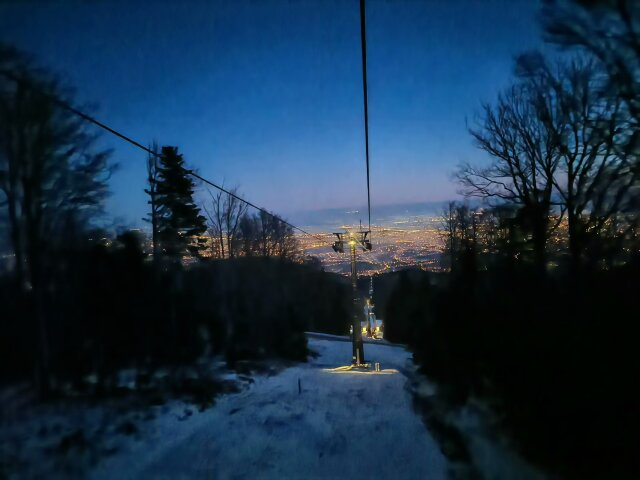
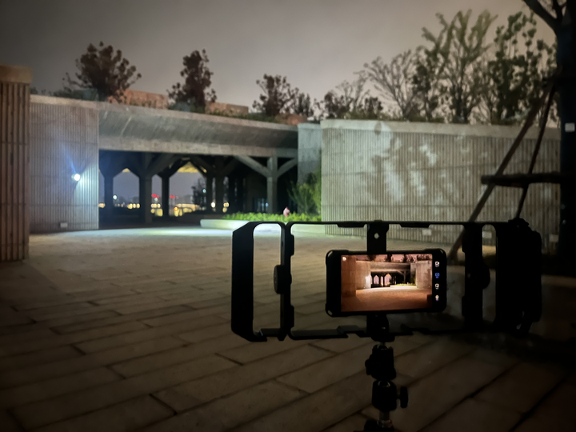

半年的时间转瞬即逝，又是一个新的学期来临。上周周末Win系统的磁盘检测导致Arch系统的磁盘寻址出了问题，卡在黑屏的sddm界面始终修不好，于是在通宵重装并克制化了新的系统后，整个人的精神一直处于比较萎靡的状态，凌晨睡不着，于是想着来码点这半年来的经历整理一下思绪。

一月，是属于自由的日子。Zagreb —> Budapest —> Dubrovnik —> Vienna —> Salzburg —> Amsterdam，一个月的交换，在南欧的天空下兜兜转转。看过了透明湛蓝的多瑙河和一望无际的地中海，第一次如此真切地感受到什么叫做清澈；也第一次见到了一望无际的雪山，在跌跌撞撞中学会了如何与雪地和冰面和解。一座座承载历史的教堂和城堡、一幅幅流传世间的名画与雕塑、一次次音乐会上钢琴与小提琴的交响...... 所有的所有，提醒着我，什么是生命，什么叫生活。

二月，结束了历时两个月对于cs:app这本书的学习，也多少算是对计算机的体系结构初窥门道了，从刚开始对于系统调用和实现的逻辑的一知半解，到逐渐开始理解和优化程序性能，再到最后自己手搓各种cache、shell、libc库和proxy，一行行宏定义、一个个函数、一段段循环，仿佛真的从死气沉沉的刻板文字变成了跳动着的二进制脉搏，这种新鲜而又新奇的感受简直让我如痴如醉，久久无法自拔。

三月和四月，一个从各方面来说都不算轻松的学期。有过很挣扎的时刻，像是深夜到滴水湖外拍电影，结果日出没拍到反到淋成了落汤鸡喜提感冒；抑或是四门课的大作业同时布置，每天盯着屏幕坐在图书馆敲到双眼眩晕，无数次为了跑通所有测试debug到凌晨4点，桌上也永远是厚厚一打密密麻麻写满推导的草稿。不过，也会有很精彩很鲜活的记忆，两个月的时间，看完了xv6的所有代码，实现了包括虚拟内存、文件系统、线程切换、系统调用的一系列拓展实验，永远记得在第一次输入gdb -r在qemu模拟的硬件上编译出系统的时候，在第一次自己新建出系统调用和内存分配的时候，在第一次手搓虚拟系统的配置网卡驱动的时候，那种单纯为计算机这美丽、简洁、精妙的系统而发自内心的好奇与渴望，那股鲸吞般汲取知识的纯粹的，快乐与兴奋，久久不能忘怀。

五月，在来之不易的假期中看完了Effective Modern C++，顺手给CN汉化组的gitbook提了点小修小补的pr；实现了上学期没来得及写完的LSM-KV键值分离存储引擎（虽然测试还不完全TT）；配好了环境，也写掉了C++ Primer，算是给BusTub开了个头；当然，还有在托福首考中吃的裸考的亏。回到学校，Web game的开发亟待完成，算法课的workload也不可谓不小，整个学期的压力开始不断显现。未来如何，尚无定论。

也许是ddl作怪，不知道从何时开始，每次写代码逐渐变成了完成任务的心态，经常为找不出来的bug破防，经常因为项目速度落后于预期而焦躁；曾经那种纯粹享受于欣赏代码本身的精妙设计和动手实现各种功能的初心，慢慢地褪色，那个对一切知识好奇，有着无限憧憬和冲动的少年，也慢慢地陷入了被生活和学业的压力所裹挟的漩涡......

这个学期，还有很多很多的事情想做：BusTub的实验、Elm实现的Web Game、Django的框架实践、高级数据结构和算法的学习...... 希望自己能一直葆有冲动和新奇，继续成为吹彻山野、不被定义的风。

仅以我最喜欢的乔布斯先生的一句话做结，也与各位共勉：“Stay hungry, stay foolish.”