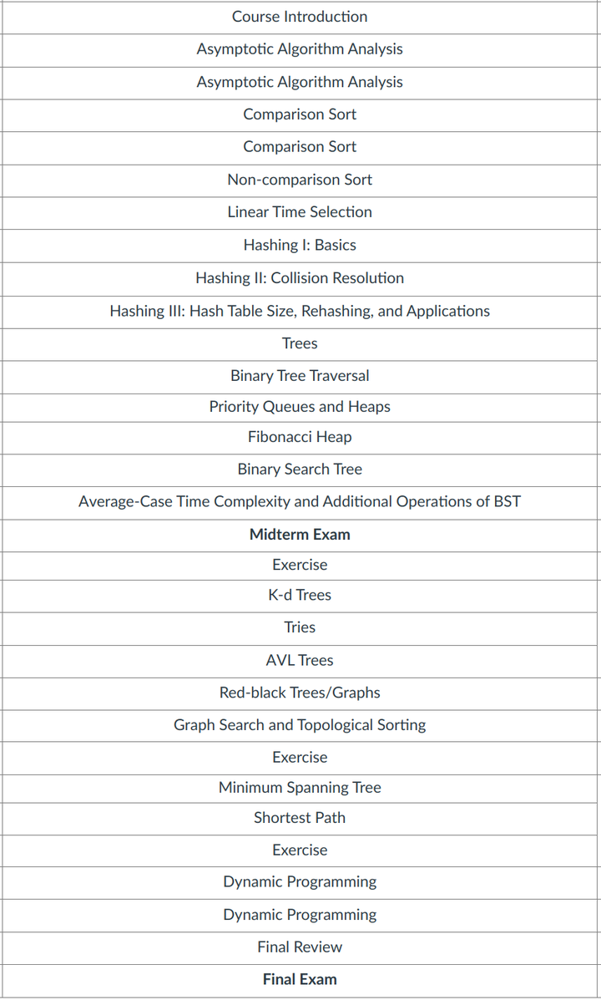
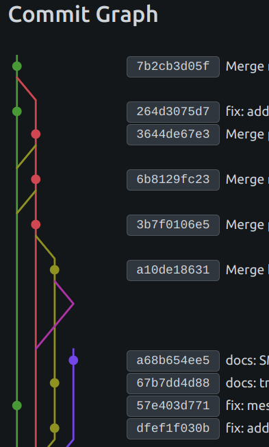
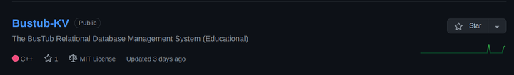

总算是要结束上半年的最后一个学期了, 感觉整个人都快虚脱了. 趁着还有点印象, 做点赛博记录.

整个学期比较硬核的coding课大概是数据结构与算法和网页游戏开发, 前者大概包括从比较和非比较排序, 线性选择的基础算法, 到哈希函数, 哈希冲突, 布隆过滤器和布谷鸟哈希的基础结构, 再到最小最大堆, 优先级队列和斐波那契堆的数据结构, 以及二叉树, 二叉搜索树, kd树, 前缀树,avl树和rb树这些平衡树, 最后到邻接矩阵和邻接表的图结构和Prim, Kruskal, Dijkstra, Floyd这些图算法, 此外还有一些贪婪和动归的基础算法. 

后者则是基于elm的函数式语言和messenger的简易游戏引擎进行前端开发, 有意思的一点是教授会给每个enroll的学生发一份合同, 然后像是公司管理一样给他俩和每一位助教安排虚拟身份和岗位, 每个小组需要严格遵守各种代码规范, 包括但不限于每周的code review, 在任何改动前先提issue, 在project版块实时更新issue进度, 定期跟进wiki, changlog和readme等等, 最麻烦的是一旦忘记某一点, 那么deduction will follow :)

除此之外, 这学期还接了点私活, 参加了SJTU选课社区2.0的开发工作, 筛选的考核是需要提交一份现有1.0框架的后端原型图, 当时其实还不算了解Django, 于是自己看了一堆教程和文档速通了一下举出用法, 和好兄弟一起约了自习室读了一遍源码, 最后赶在ddl之前提交了方案, 所幸是成功入选了开发团队, 于是后面便开始了每周的开发对接和定期code review. 不过现在的版本后端又改为了基于Go语言的Gin框架, 除了并发性能, 我自己其实不太喜欢这种tag类的一大堆标签注释, 真论层次还得是Spring Boot清晰 :(

偶尔空点时间出来, 也跟进了一下CMU15-445的课程, 教材Database System Concepts看了5,6章的样子, 基本上把SQL的用法和设计看完了, 然后lecture看到了第8节, 大体上把Advanced SQL, Database Storage, Buffer Pools和Hash Tables弄懂了, 顺带复习了一下B/B+树的结构和操作, 不过目前只写完了project 0和project 1, 估计暑假应该能收个尾吧.

这学期说是赤了选课的石, 本来有更轻松的课可以平替, 不过真正走完还是觉得挺释然的, 至少这三个多月是真的相当充实, 甚至是离谱的满负荷. 暑假应该会继续开发和db的学习, 以及必须拿下的托福, 除此之外还得健健身锻炼一下, 这学期一直断断续续的生病还是体质太差了.

Anyway,  祝自己好运. Stay hungry, stay foolish.